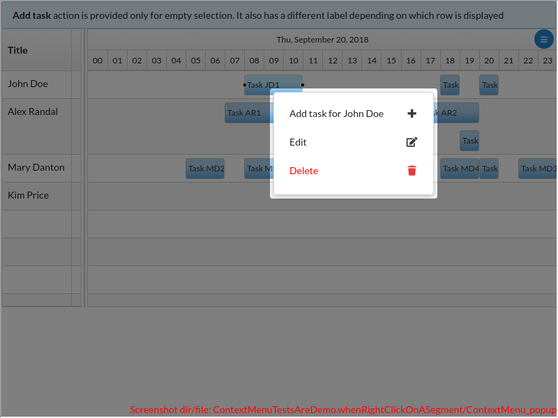
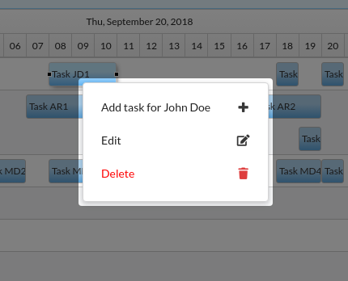
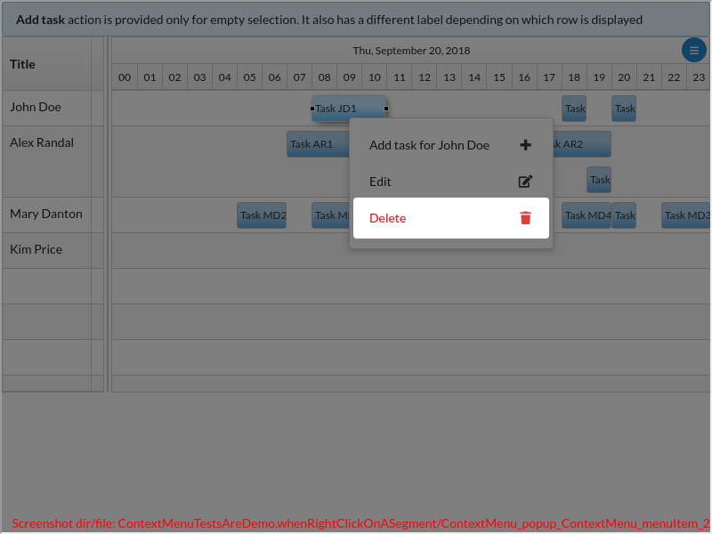
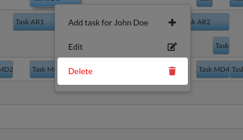
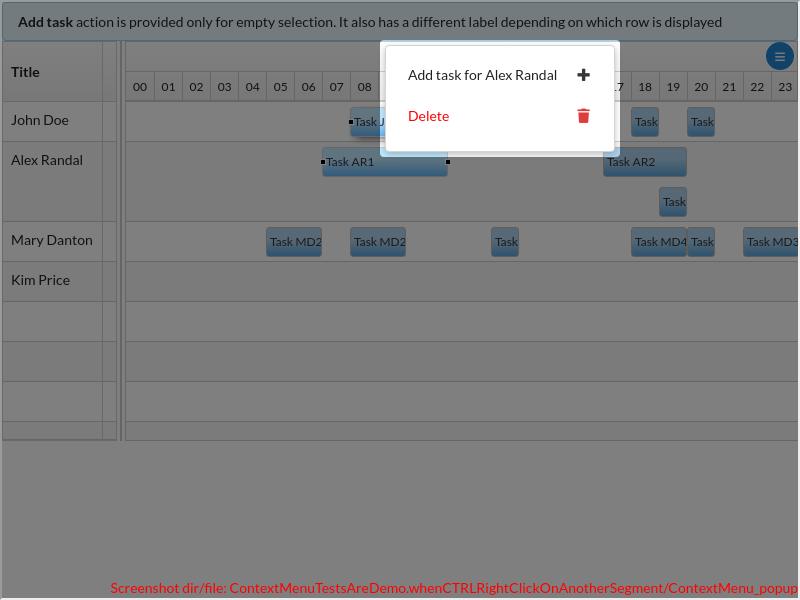
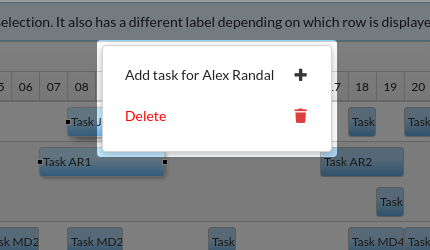
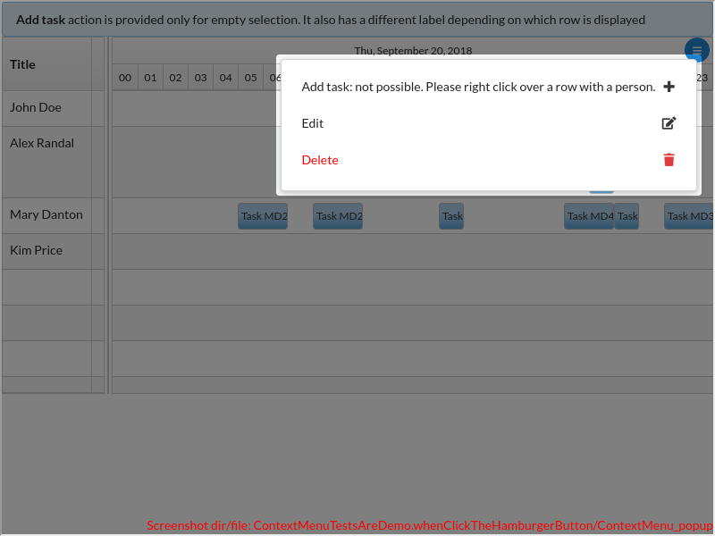
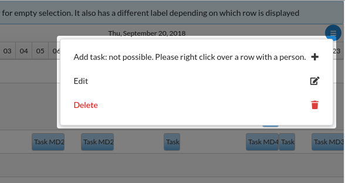

<table>
<tr>
<th>Fig. 1</th>
<th>Fig. 2</th>
</tr>
<tr>
<td>

Click to expand full image

 

On right click, a context menu appears. Each line of the context menu is an **action**. An action has a **label**, **icon**, and a **run** callback (called when the user clicks on it).

</td>
<td>

Click to expand full image

 

If label and icon is not enough, a custom renderer can be provided. It can be a normal renderer w/ some additional customizations (e.g. color). Or it can be any arbitrary component.

</td>
</tr>
</table>
<table>
<tr>
<th>Fig. 3</th>
<th>Fig. 4</th>
</tr>
<tr>
<td>

Click to expand full image

 

Before the actions are displayed, they are 'asked' is they want to be visible or not. They usually decide this based on the **current selection**. E.g. here, the *Edit* action is not shown, because it needs exactly one element is selected (and 2 are currently selected).

</td>
<td>

Click to expand full image

 

The menu can also be opened from the **hamburger button**. Particular useful on mobile.

 Based on the selection, an action can perform any logic, not only decide its visibility. E.g. here it changes its label, complaining that there is no current row. True: when the context menu is opened from the hamburger button, we have selection, but we don't have mouse info (x, y, current row).

</td>
</tr>
</table>
