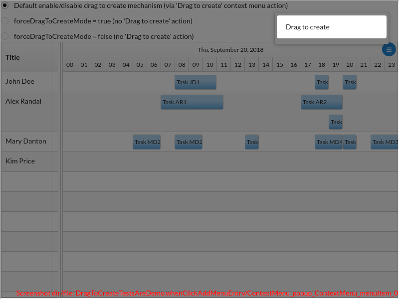
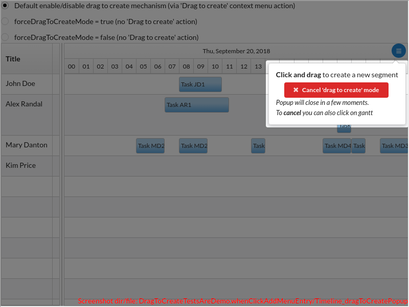
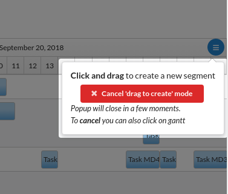
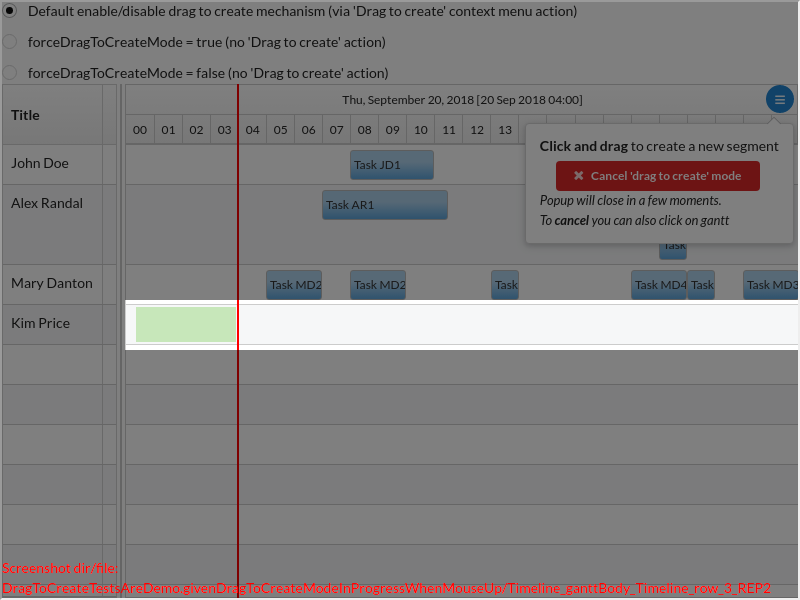
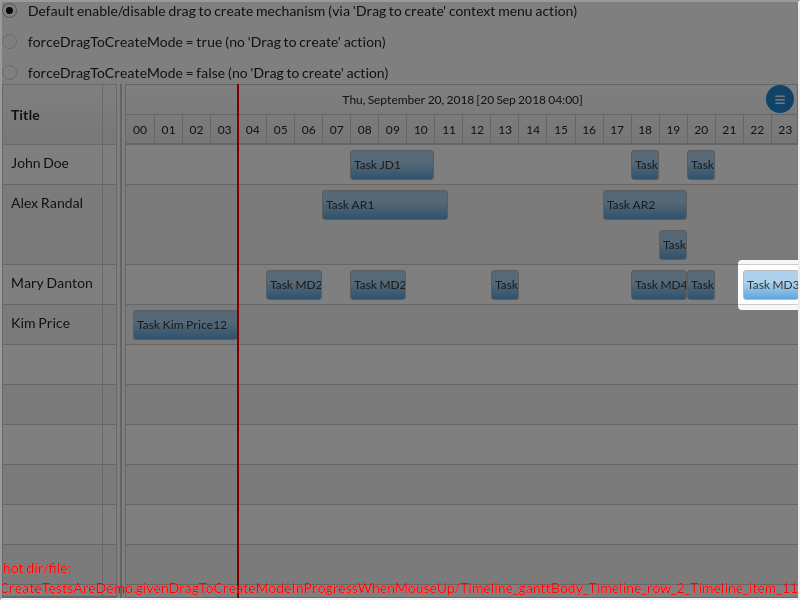
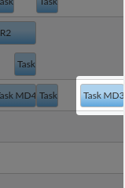

<table>
<tr>
<th>Fig. 1</th>
<th>Fig. 2</th>
</tr>
<tr>
<td>

Click to expand full image

 

Open the context menu (right click or click on the hamburger button from the top/left corner. Click ...

</td>
<td>

Click to expand full image

 

... and you enter in the 'drag to create' mode. The popup hides itself quickly, to make sure it doesn't bother the user. This mode is cancelable via button or simple click (i.e. not click and drag).

</td>
</tr>
</table>
<table>
<tr>
<th>Fig. 3</th>
<th>Fig. 4</th>
</tr>
<tr>
<td>

Click to expand full image

 

Click and drag on a row. A green rectangle appears as you drag. A right drag cancels the operation and exits the 'drag to create' mode.

 **TODO!!!** avem acest comportament de anulare a dragului?

</td>
<td>

Click to expand full image

 

When you do `mouse up` (to `drop`), your handler will be called, receiving useful args (e.g. row, start/end, etc.). It can e.g. create a new segment.

 **TODO!!!** poza nu e buna. Ar fi trebuit sa captureze segmentul nou creat

</td>
</tr>
</table>
