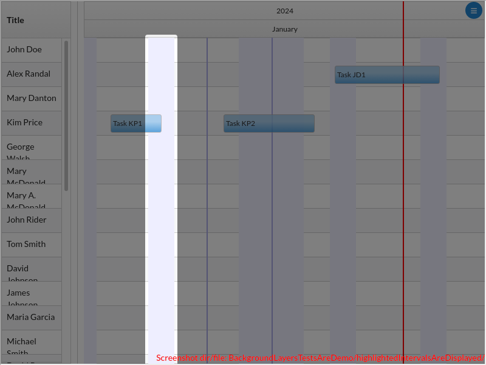
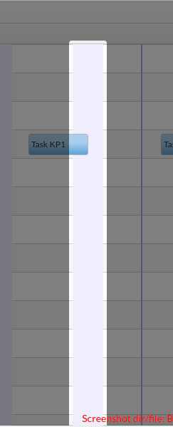

# BackgroundLayersTestsAreDemo/highlightedIntervalsAreDisplayed()

### undefined

---

## The following error was caught while running the test:

```
Error: Uncaught TypeError: Cannot read properties of null (reading 'recomputeGridSize') (http://localhost:3000/@fs/home/poweruser/git/react-timeline-10000/src/timeline.js:433)
	  at _global.onerror [fn(new Error(err + ' (' + url + ':' + line + ')'));] (http://localhost:3000/node_modules/mocha/browser-entry.js:75:10)
```

---


There are 1 screenshots. [Go to first](#screenshot-1)

## BackgroundLayersTestsAreDemo.tsx

<details><summary>Click to expand the hidden lines of code</summary>

```tsx
/* 1*/import { Only, Scenario, render, tad } from "@famiprog-foundation/tests-are-demo";
/* 2*/import { Main } from "../stories/backgroundLayer/BackgroundLayer.stories";
/* 3*/import { dateAndHourOfCurrentMonth } from "../stories/sampleData";
/* 4*/import {PARENT_ELEMENT, Timeline, getPixelAtTime, getPixelsFromDuration, highlightedIntervalTestIds} from "@famiprog-foundation/react-gantt";
/* 5*/import moment from "moment";
/* 6*/
/* 7*/export class BackgroundLayersTestsAreDemo {
```

</details>

```tsx
/* 8*/    async before() {
/* 9*/        render(<Main/>);
/*10*/    }
/*11*/    
/*12*/    @Scenario("The highlighted intervals are correctly displayed")
/*13*/    async highlightedIntervalsAreDisplayed() {
/*14*/        const ganttLeftOffset = PARENT_ELEMENT(tad.getObjectViaCheat(Timeline).props.componentId).getBoundingClientRect().left;
/*15*/
/*16*/        var interval = tad.screenCapturing.getByTestId(highlightedIntervalTestIds.interval + "_0");
/*17*/        await tad.assertWaitable.exists(interval);
```

<table><tr>
<td>

### Screenshot 1


<details><summary>Click to expand full image</summary>

BackgroundLayersTestsAreDemo/highlightedIntervalsAreDisplayed/HighlightedInterval_interval_0.png <br/>


</details>
</td>
<td>



</td>
</tr></table>

<details><summary>Click to expand the hidden lines of code</summary>

```tsx
/*18*/        await tad.assertWaitable.equal(Math.round(interval.getBoundingClientRect().x - ganttLeftOffset), this.getPixelsAtDate(dateAndHourOfCurrentMonth(4)));
/*19*/        await tad.assertWaitable.equal(interval.getBoundingClientRect().width, this.getPixelsFromDuration(dateAndHourOfCurrentMonth(4), dateAndHourOfCurrentMonth(6)));
/*20*/
/*21*/        interval = tad.screenCapturing.getByTestId(highlightedIntervalTestIds.interval + "_1");
/*22*/        await tad.assertWaitable.exists(interval);
/*23*/        await tad.assertWaitable.equal(Math.round(interval.getBoundingClientRect().x - ganttLeftOffset), this.getPixelsAtDate(dateAndHourOfCurrentMonth(11)));
/*24*/        await tad.assertWaitable.equal(interval.getBoundingClientRect().width, this.getPixelsFromDuration(dateAndHourOfCurrentMonth(11), dateAndHourOfCurrentMonth(13)));
/*25*/
/*26*/        interval = tad.screenCapturing.getByTestId(highlightedIntervalTestIds.interval + "_2");
/*27*/        await tad.assertWaitable.exists(interval);
/*28*/        await tad.assertWaitable.equal(Math.round(interval.getBoundingClientRect().x - ganttLeftOffset), this.getPixelsAtDate(dateAndHourOfCurrentMonth(18)));
/*29*/        await tad.assertWaitable.equal(interval.getBoundingClientRect().width, this.getPixelsFromDuration(dateAndHourOfCurrentMonth(18), dateAndHourOfCurrentMonth(20)));
/*30*/
/*31*/        interval = tad.screenCapturing.getByTestId(highlightedIntervalTestIds.interval + "_3");
/*32*/        await tad.assertWaitable.exists(interval);
/*33*/        await tad.assertWaitable.equal(Math.round(interval.getBoundingClientRect().x - ganttLeftOffset), this.getPixelsAtDate(dateAndHourOfCurrentMonth(25)));
/*34*/        await tad.assertWaitable.equal(interval.getBoundingClientRect().width, this.getPixelsFromDuration(dateAndHourOfCurrentMonth(25), dateAndHourOfCurrentMonth(27)));
/*35*/
/*36*/        interval = tad.screenCapturing.getByTestId(highlightedIntervalTestIds.interval + "_4");
/*37*/        await tad.assertWaitable.exists(interval);
/*38*/        await tad.assertWaitable.equal(Math.round(interval.getBoundingClientRect().x - ganttLeftOffset), this.getPixelsAtDate(dateAndHourOfCurrentMonth(1)));
/*39*/        await tad.assertWaitable.equal(interval.getBoundingClientRect().width, this.getPixelsFromDuration(dateAndHourOfCurrentMonth(1), dateAndHourOfCurrentMonth(2)));
/*40*/
/*41*/        interval = tad.screenCapturing.getByTestId(highlightedIntervalTestIds.interval + "_5");
/*42*/        await tad.assertWaitable.exists(interval);
/*43*/        await tad.assertWaitable.equal(Math.round(interval.getBoundingClientRect().x - ganttLeftOffset), this.getPixelsAtDate(dateAndHourOfCurrentMonth(15)));
/*44*/        await tad.assertWaitable.equal(interval.getBoundingClientRect().width, this.getPixelsFromDuration(dateAndHourOfCurrentMonth(15), dateAndHourOfCurrentMonth(18)));
/*45*/
/*46*/        interval = tad.screenCapturing.getByTestId(highlightedIntervalTestIds.interval + "_6");
/*47*/        await tad.assertWaitable.exists(interval);
/*48*/        await tad.assertWaitable.equal(Math.round(interval.getBoundingClientRect().x - ganttLeftOffset), this.getPixelsAtDate(dateAndHourOfCurrentMonth(20, 19)));
/*49*/        await tad.assertWaitable.equal(interval.getBoundingClientRect().width, this.getPixelsFromDuration(dateAndHourOfCurrentMonth(20, 19), dateAndHourOfCurrentMonth(21, 10)));
/*50*/    }
/*51*/
/*52*/    getPixelsAtDate(date) {
/*53*/        const timeline = tad.getObjectViaCheat(Timeline);
/*54*/        return Math.round(getPixelAtTime(moment(date), timeline.getStartDate(), timeline.getEndDate(), timeline.getTimelineWidth(undefined)));
/*55*/    }
/*56*/    getPixelsFromDuration(start, end) {
/*57*/        const timeline = tad.getObjectViaCheat(Timeline);
/*58*/        return Math.round(getPixelsFromDuration(moment(end).diff(start, "milliseconds"), timeline.getStartDate(), timeline.getEndDate(), timeline.getTimelineWidth(undefined), timeline.getTimelineSnap()));
/*59*/
/*60*/    }
/*61*/}
```

</details>
