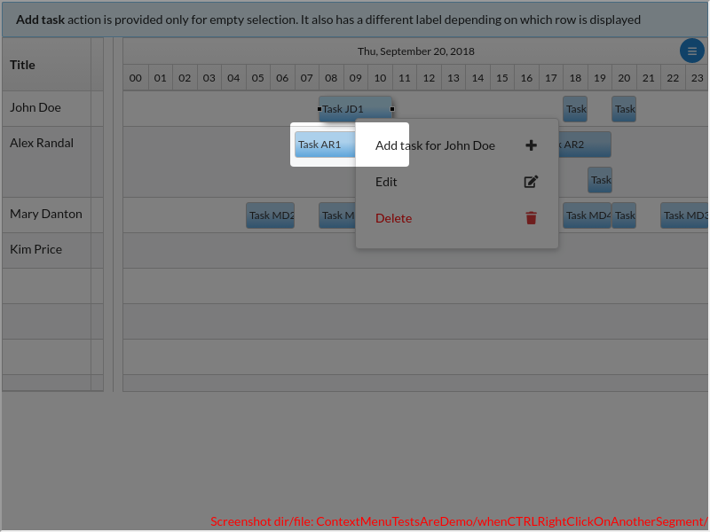
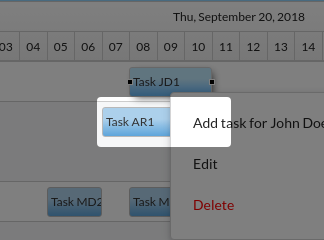
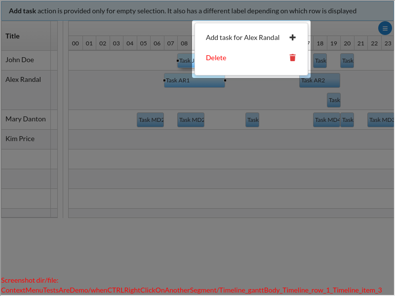
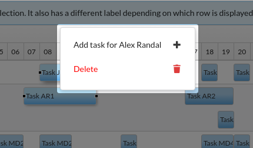
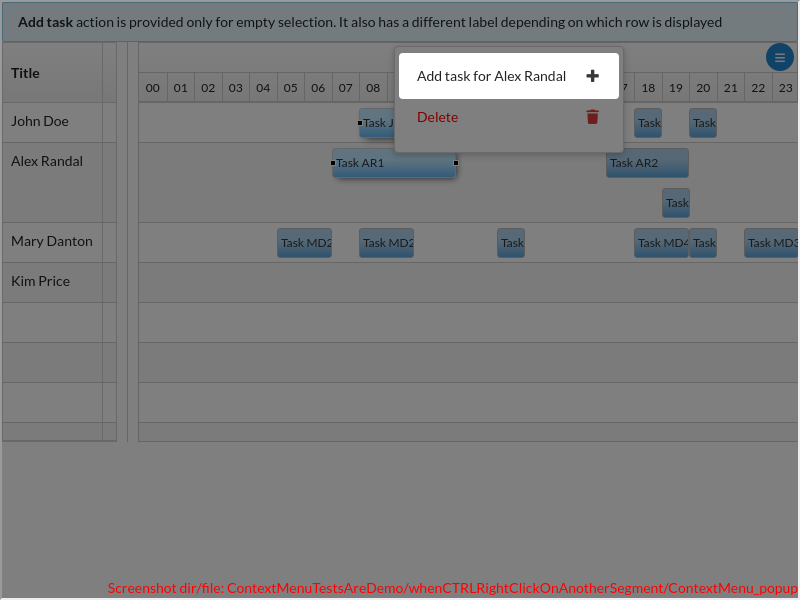
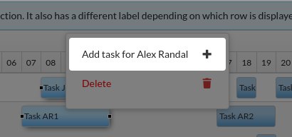
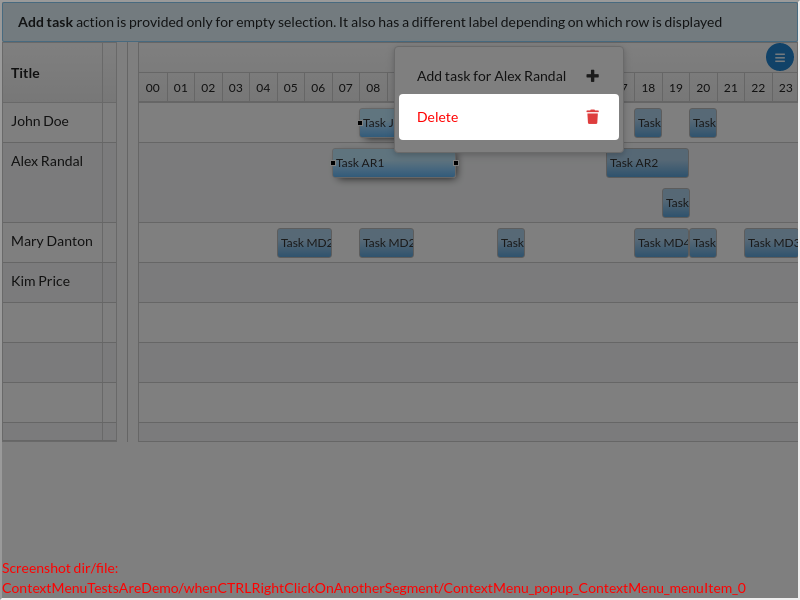
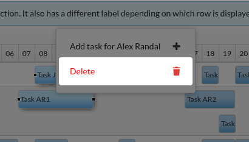

# ContextMenuTestsAreDemo/whenCTRLRightClickOnAnotherSegment()

### undefined

---

There are 4 screenshots. [Go to first](#screenshot-1)

## ContextMenuTestsAreDemo.tsx

<details><summary>Click to expand the hidden lines of code</summary>

```tsx
/*  1*/import { Only, Scenario, ScenarioOptions, render, tad } from "@famiprog-foundation/tests-are-demo";
/*  2*/import { contextMenuTestIds } from "../../../src/components/ContextMenu/ContextMenu";
/*  3*/import { ContextMenu, addTaskActionIcon, addTaskActionLabel, addTaskNotPossibleAction, deleteActionIcon, deleteActionIconColor, deleteActionLabel, editActionLabel } from "../stories/contextMenuAndSelection/ContextMenuAndSelection.stories";
/*  4*/import { someHumanResources, someTasks } from "../stories/sampleData";
/*  5*/import Timeline, { PARENT_ELEMENT, timelineTestids as testids } from "../../../src/timeline";
/*  6*/import { getPixelAtTime, getTimeAtPixel } from "../../../src/utils/timeUtils";
/*  7*/import { rightClick } from "./testUtils";
/*  8*/
/*  9*/const CLICK_X =30;
/* 10*/export class ContextMenuTestsAreDemo {
/* 11*/
/* 12*/    async before() {
/* 13*/        render(<ContextMenu />);
/* 14*/    }
/* 15*/
/* 16*/    @Scenario("WHEN I right click on a row, THEN a context menu with one action opens")
/* 17*/    @ScenarioOptions({ linkWithNextScenario: true })
/* 18*/    async whenRightClickOnARow() {
/* 19*/        // WHEN right click on a row
/* 20*/        const firstRow = tad.screenCapturing.getByTestId(testids.row + "_0");
/* 21*/        const clickPosition = { clientX: Math.round(firstRow.getBoundingClientRect().x) + CLICK_X, clientY: Math.round(firstRow.getBoundingClientRect().y) + 20 };
/* 22*/        await tad.showSpotlight({ message: "I right click on a row", focusOnLastElementCaptured: true });
/* 23*/        rightClick(firstRow, clickPosition);
/* 24*/
/* 25*/        // THEN CM is opened at the clicked position
/* 26*/        tad.demoForEndUserHide();
/* 27*/        const popup = tad.screenCapturing.getByTestId(contextMenuTestIds.popup);
/* 28*/        await tad.assertWaitable.exists(popup);
/* 29*/        await this.isPopupPositionedNearPoint(popup.getBoundingClientRect(), { x: clickPosition.clientX, y: clickPosition.clientY });
/* 30*/        tad.demoForEndUserShow();
/* 31*/
/* 32*/        // AND it has an 'Add task' actions
/* 33*/        let menuEntry = tad.withinCapturing(popup).getByTestId(contextMenuTestIds.menuItem + "_0");
/* 34*/        tad.cc("The context menu contains an 'Add' action");
/* 35*/        await tad.assertWaitable.equal(menuEntry.textContent, addTaskActionLabel + someHumanResources[0].title);
/* 36*/        tad.demoForEndUserHideNext();
/* 37*/        await tad.assertWaitable.include(menuEntry.querySelector("i").className, addTaskActionIcon);
/* 38*/    }
/* 39*/
/* 40*/    @Scenario("WHEN I click on an action, THEN the action is run (w/ or w/o closing the menu)")
/* 41*/    @ScenarioOptions({ linkWithNextScenario: true })
/* 42*/    async whenClickAnAction() {
/* 43*/        // WHEN I click on "Add"
/* 44*/        const popup = tad.screenCapturing.getByTestId(contextMenuTestIds.popup);
/* 45*/        await tad.userEventWaitable.click(tad.withinCapturing(popup).getByTestId(contextMenuTestIds.menuItem + "_0"));
/* 46*/
/* 47*/        // THEN a new task is added
/* 48*/        let newSegment = tad.screenCapturing.getByTestId(testids.item + "_" + someTasks.length);
/* 49*/        await tad.assertWaitable.exists(newSegment);
/* 50*/
/* 51*/        tad.demoForEndUserHide();
/* 52*/        // AND the CM is closed
/* 53*/        await tad.assertWaitable.notExists(tad.screenCapturing.queryByTestId(contextMenuTestIds.popup));
/* 54*/
/* 55*/        // AND the new task is position correctly on x axes
/* 56*/        // Gantt works with times "snapped to grid" so the position for the new task should be snapped to grid 
/* 57*/        const timeline = tad.getObjectViaCheat(Timeline);
/* 58*/        const firstRow = tad.screenCapturing.getByTestId(testids.row + "_0");
/* 59*/        const ganttLeftOffset = PARENT_ELEMENT(timeline.props.componentId).getBoundingClientRect().left;
/* 60*/        const clickedX = firstRow.getBoundingClientRect().x + CLICK_X;
/* 61*/        const clickedXInGantt = clickedX - ganttLeftOffset;
/* 62*/        const clickedTime = getTimeAtPixel(clickedXInGantt, timeline.getStartDate(), timeline.getEndDate(), timeline.getTimelineWidth(undefined), timeline.getTimelineSnap());
/* 63*/        const clickedXSnappedToGrid = getPixelAtTime(clickedTime, timeline.getStartDate(), timeline.getEndDate(), timeline.getTimelineWidth(undefined))
/* 64*/             + ganttLeftOffset;     
/* 65*/        await tad.assertWaitable.equal(Math.round(newSegment.getBoundingClientRect().x), Math.round(clickedXSnappedToGrid));
/* 66*/        
/* 67*/        // AND is correctly added to the clicked row
/* 68*/        await tad.assertWaitable.equal(newSegment.getBoundingClientRect().y, firstRow.getBoundingClientRect().y);
/* 69*/        tad.demoForEndUserShow();
/* 70*/    }
/* 71*/
/* 72*/    @Scenario("WHEN I right click on a segment, THEN a context menu with 3 actions is shown")
/* 73*/    @ScenarioOptions({ linkWithNextScenario: true })
/* 74*/    async whenRightClickOnASegment() {
/* 75*/        const segment = tad.screenCapturing.getByTestId(testids.item + "_0");
/* 76*/        const segmentBoundingRect = segment.getBoundingClientRect();
/* 77*/
/* 78*/        // WHEN right click on a segment
/* 79*/        await tad.showSpotlight({ message: "I right click on a segment", focusOnLastElementCaptured: true });
/* 80*/        rightClick(segment, { clientX: segmentBoundingRect.x + segmentBoundingRect.width / 2, clientY: segmentBoundingRect.y + segmentBoundingRect.height / 2 });
/* 81*/        
/* 82*/        // THEN the CM opens
/* 83*/        tad.demoForEndUserHideNext();
/* 84*/        const popup = tad.screenCapturing.getByTestId(contextMenuTestIds.popup);
/* 85*/        await tad.assertWaitable.exists(popup);
/* 86*/
/* 87*/        // AND it has: 'Add', 'Edit' and 'Delete' actions
/* 88*/        tad.cc("The context menu contains an 'Add' action");
/* 89*/        await tad.assertWaitable.equal(tad.withinCapturing(popup).getByTestId(contextMenuTestIds.menuItem + "_0").textContent, addTaskActionLabel + someHumanResources[0].title);
/* 90*/        
/* 91*/        tad.cc("And an 'Edit' action");
/* 92*/        await tad.assertWaitable.equal(tad.withinCapturing(popup).getByTestId(contextMenuTestIds.menuItem + "_1").textContent, editActionLabel);
/* 93*/        
/* 94*/        tad.cc("And a 'Delete' action");
/* 95*/        let menuEntry = tad.withinCapturing(popup).getByTestId(contextMenuTestIds.menuItem + "_2");
/* 96*/        await tad.assertWaitable.equal(menuEntry.textContent, deleteActionLabel);
/* 97*/        tad.cc("With a custom red renderer");
/* 98*/        tad.demoForEndUserHideNext();
```

</details>

```tsx
/* 99*/        await tad.assertWaitable.include(menuEntry.querySelector("i").className, deleteActionIcon);
/*100*/        await tad.assertWaitable.include(menuEntry.querySelector("i").className, deleteActionIconColor);
/*101*/    }
/*102*/
/*103*/    @Scenario("WHEN I CTRL + right click on another segment, THEN a context menu with 2 actions is shown")
/*104*/    @ScenarioOptions({ linkWithNextScenario: true })
/*105*/    async whenCTRLRightClickOnAnotherSegment() {
/*106*/        const segment = tad.screenCapturing.getByTestId(testids.item + "_3");
/*107*/        const segmentBoundingRect = segment.getBoundingClientRect();
/*108*/        await tad.showSpotlight({ message: "WHEN I CTRL + right click another segment", focusOnLastElementCaptured: true });
```

<table><tr>
<td>

### Screenshot 1

 [Go to next](#screenshot-2)

<details><summary>Click to expand full image</summary>

ContextMenuTestsAreDemo/whenCTRLRightClickOnAnotherSegment/Timeline_ganttBody_Timeline_row_1_Timeline_item_3.png <br/>


</details>
</td>
<td>



</td>
</tr></table>

```tsx
/*109*/        rightClick(segment, { ctrlKey: true, clientX: segmentBoundingRect.x + segmentBoundingRect.width / 2, clientY: segmentBoundingRect.y + segmentBoundingRect.height / 2 });
/*110*/
/*111*/        // THEN the CM opens
/*112*/        tad.demoForEndUserHideNext();
/*113*/        const popup = tad.screenCapturing.getByTestId(contextMenuTestIds.popup);
/*114*/        await tad.assertWaitable.exists(popup);
```

<table><tr>
<td>

### Screenshot 2

[Go to previous](#screenshot-1) |  [Go to next](#screenshot-3)

<details><summary>Click to expand full image</summary>

ContextMenuTestsAreDemo/whenCTRLRightClickOnAnotherSegment/ContextMenu_popup.png <br/>


</details>
</td>
<td>



</td>
</tr></table>

```tsx
/*115*/
/*116*/        // AND it has: 'Add' and 'Delete' actions
/*117*/        tad.cc("The context menu contains an 'Add' action");
/*118*/        await tad.assertWaitable.equal(tad.withinCapturing(popup).getByTestId(contextMenuTestIds.menuItem + "_0").textContent, addTaskActionLabel + someHumanResources[1].title);
```

<table><tr>
<td>

### Screenshot 3

[Go to previous](#screenshot-2) |  [Go to next](#screenshot-4)

<details><summary>Click to expand full image</summary>

ContextMenuTestsAreDemo/whenCTRLRightClickOnAnotherSegment/ContextMenu_popup_ContextMenu_menuItem_0.png <br/>


</details>
</td>
<td>



</td>
</tr></table>

```tsx
/*119*/        
/*120*/        tad.cc("And a 'Delete' action");
/*121*/        await tad.assertWaitable.equal(tad.withinCapturing(popup).getByTestId(contextMenuTestIds.menuItem + "_1").textContent, deleteActionLabel);
```

<table><tr>
<td>

### Screenshot 4

[Go to previous](#screenshot-3)

<details><summary>Click to expand full image</summary>

ContextMenuTestsAreDemo/whenCTRLRightClickOnAnotherSegment/ContextMenu_popup_ContextMenu_menuItem_1.png <br/>


</details>
</td>
<td>



</td>
</tr></table>

<details><summary>Click to expand the hidden lines of code</summary>

```tsx
/*122*/    }
/*123*/
/*124*/    @Scenario("WHEN I click the hamburger button, THEN the context menu is shown besides that button")
/*125*/    async whenClickTheHamburgerButton() {
/*126*/        // GIVEN I select one segment
/*127*/        await tad.userEventWaitable.click(tad.screenCapturing.getByTestId(testids.item + "_1"));
/*128*/
/*129*/        // WHEN
/*130*/        const menuButton = tad.screenCapturing.getByTestId(testids.menuButton);
/*131*/        tad.cc("Click on the menu button");
/*132*/        await tad.userEventWaitable.click(menuButton);
/*133*/
/*134*/        // THEN the context menu is opened and positioned near the center of the hamburger button");
/*135*/        tad.demoForEndUserHide();
/*136*/        const popup = tad.screenCapturing.getByTestId(contextMenuTestIds.popup);
/*137*/        await tad.assertWaitable.exists(popup);
/*138*/        const menuButtonCenter = { x: menuButton.getBoundingClientRect().x + menuButton.getBoundingClientRect().width / 2, y: menuButton.getBoundingClientRect().y + menuButton.getBoundingClientRect().height / 2 };
/*139*/        await this.isPopupPositionedNearPoint(popup.getBoundingClientRect(), menuButtonCenter);
/*140*/        tad.demoForEndUserShow();
/*141*/
/*142*/        // AND it has: 'Add task: not possible', 'Edit' adn 'Delete' actions
/*143*/        tad.cc("The context menu contains an 'Add task not possible' action");
/*144*/        await tad.assertWaitable.equal(tad.withinCapturing(popup).getByTestId(contextMenuTestIds.menuItem + "_0").textContent, addTaskNotPossibleAction);
/*145*/        tad.cc("And an 'Edit' action");
/*146*/        await tad.assertWaitable.equal(tad.withinCapturing(popup).getByTestId(contextMenuTestIds.menuItem + "_1").textContent, editActionLabel);
/*147*/        tad.cc("And a 'Delete' action");
/*148*/        await tad.assertWaitable.equal(tad.withinCapturing(popup).getByTestId(contextMenuTestIds.menuItem + "_2").textContent, deleteActionLabel);
/*149*/
/*150*/        // WHEN click 'Edit' (dontCloseContextMenuAfterRunAutomatically = true) THEN the CM doesn't close 
/*151*/        // We putted this verification at the end of the tests, because else we needed to close the prompt for the next scenarios, and this was not trivial 
/*152*/        tad.demoForEndUserHide();
/*153*/        await tad.userEventWaitable.click(tad.withinCapturing(popup).getByTestId(contextMenuTestIds.menuItem + "_1"));
/*154*/        await tad.assertWaitable.exists(tad.screenCapturing.getByTestId(contextMenuTestIds.popup));
/*155*/        tad.demoForEndUserShow();
/*156*/    }
/*157*/
/*158*/    async isPopupPositionedNearPoint({ x: popupX, y: popupY, width: popupWidth, height: popupHeight }, { x, y }) {
/*159*/        const popupEndX = Math.round(popupX + popupWidth);
/*160*/        const popupEndY = Math.round(popupY + popupHeight);
/*161*/        popupX = Math.floor(popupX);
/*162*/        popupY = Math.round(popupY);
/*163*/
/*164*/        // We didn't understood why it is a difference of some decimals (maximum 1 px) between the expected position and the actual position. 
/*165*/        // These difference in decimals is not the same every time, is variable regarding the dimension of the window and the dpi of the screen
/*166*/        // So the only thing in common is that the actual value is near the expected one at a maximum 1 px distance (below or above)
/*167*/        await tad.assertWaitable.include([popupX - 1, popupX, popupX + 1, popupEndX - 1, popupEndX, popupEndX + 1], Math.round(x));
/*168*/        // semantic ui popup is displayed 10 px below or 10 px above the mouse position
/*169*/        await tad.assertWaitable.include([popupY - 11, popupY - 10, popupY - 9, popupEndY + 9, popupEndY + 10, popupEndY + 11], Math.round(y));
/*170*/    }
/*171*/}
```

</details>
