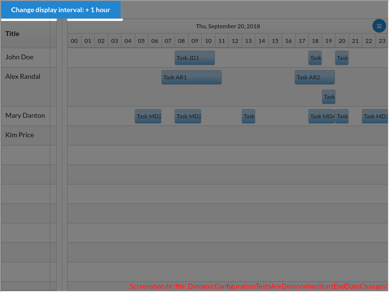
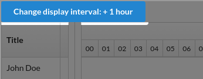
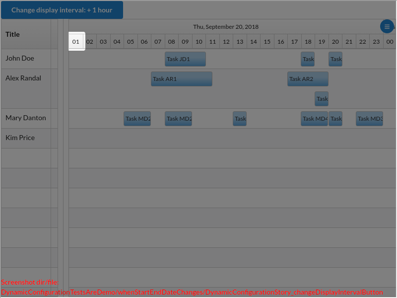
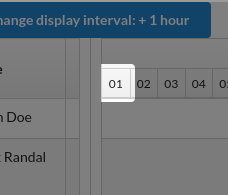
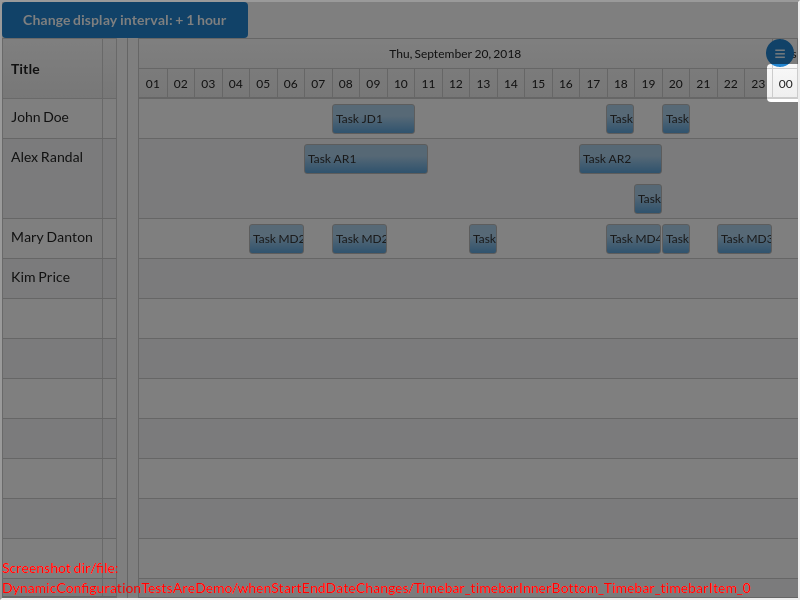
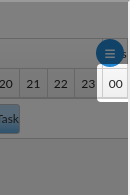

# DynamicConfigurationTestsAreDemo/whenStartEndDateChanges()

### undefined

---

There are 3 screenshots. [Go to first](#screenshot-1)

## DynamicConfigurationTestsAreDemo.tsx

<details><summary>Click to expand the hidden lines of code</summary>

```tsx
/* 1*/import { Only, Scenario, ScenarioOptions, render, tad } from "@famiprog-foundation/tests-are-demo";
/* 2*/import { Main, testIds } from "../stories/dynamicConfiguration/DynamicConfiguration.stories";
/* 3*/import { timebarTestIds } from "../../../src/components/timebar";
/* 4*/
/* 5*//**
/* 6*/ * @author Daniela Buzatu
```

</details>

```tsx
/* 7*/ */
/* 8*/export class DynamicConfigurationTestsAreDemo {
/* 9*/    async before() {
/*10*/        render(<Main/>);
/*11*/    }
/*12*/
/*13*/    @Scenario("WHEN I change the startDate/endDate properties THEN the new interval is displayed")
/*14*/    async whenStartEndDateChanges() {
/*15*/        // WHEN I change the start/end date properties by clicking the "Change display interval" button
/*16*/        await tad.userEventWaitable.click(tad.screenCapturing.getByTestId(testIds.changeDisplayIntervalButton));
```

<table><tr>
<td>

### Screenshot 1

 [Go to next](#screenshot-2)

<details><summary>Click to expand full image</summary>

DynamicConfigurationTestsAreDemo/whenStartEndDateChanges/DynamicConfigurationStory_changeDisplayIntervalButton.png <br/>


</details>
</td>
<td>



</td>
</tr></table>

```tsx
/*17*/        
/*18*/        // THEN the new interval is displayed
/*19*/        const timebarBottom = tad.screenCapturing.getByTestId(timebarTestIds.timebarInnerBottom);
/*20*/        await tad.assertWaitable.oneOf(tad.withinCapturing(timebarBottom).getByTestId(timebarTestIds.timebarItem + "_" + 0).textContent, ["01", "01:00"]);
```

<table><tr>
<td>

### Screenshot 2

[Go to previous](#screenshot-1) |  [Go to next](#screenshot-3)

<details><summary>Click to expand full image</summary>

DynamicConfigurationTestsAreDemo/whenStartEndDateChanges/Timebar_timebarInnerBottom_Timebar_timebarItem_0.png <br/>


</details>
</td>
<td>



</td>
</tr></table>

```tsx
/*21*/        await tad.assertWaitable.oneOf(tad.withinCapturing(timebarBottom).getByTestId(timebarTestIds.timebarItem + "_" + 23).textContent, ["00", "00:00"]);
```

<table><tr>
<td>

### Screenshot 3

[Go to previous](#screenshot-2)

<details><summary>Click to expand full image</summary>

DynamicConfigurationTestsAreDemo/whenStartEndDateChanges/Timebar_timebarInnerBottom_Timebar_timebarItem_23.png <br/>


</details>
</td>
<td>



</td>
</tr></table>

<details><summary>Click to expand the hidden lines of code</summary>

```tsx
/*22*/    }
/*23*/}
```

</details>
