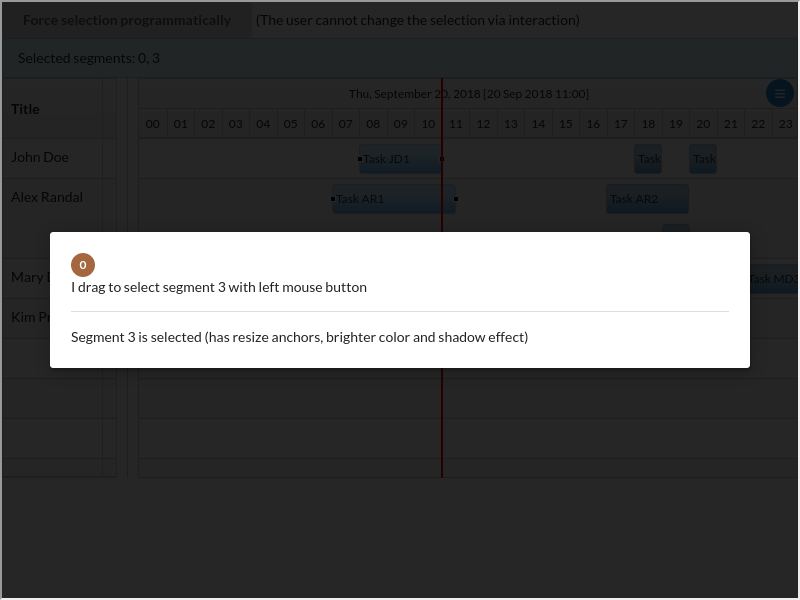
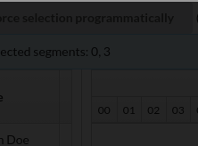
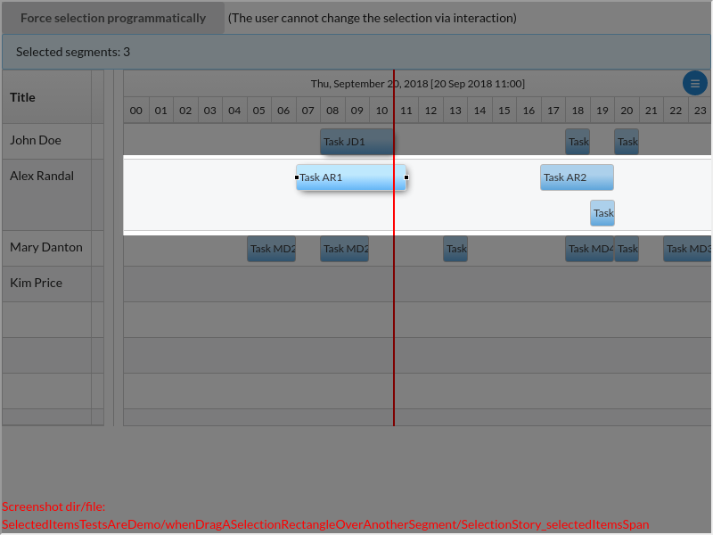
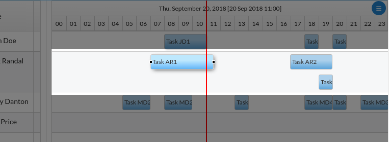
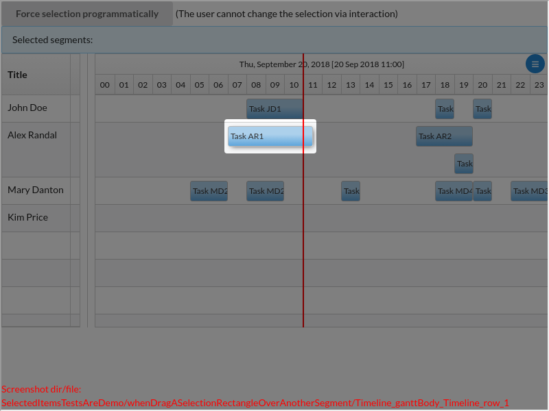
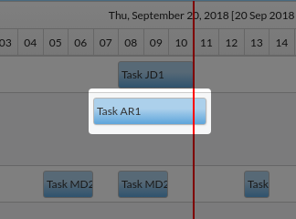
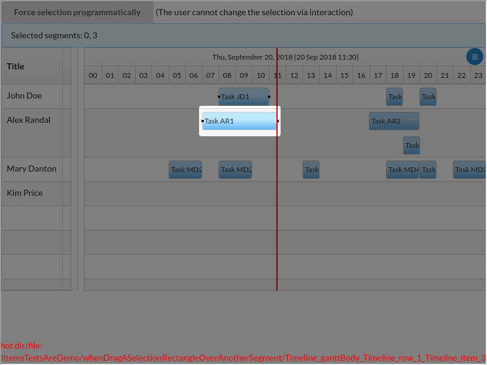
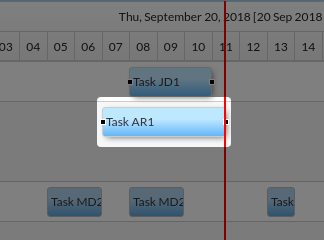

# SelectedItemsTestsAreDemo/whenDragASelectionRectangleOverAnotherSegment()

### undefined

---

There are 4 screenshots. [Go to first](#screenshot-1)

## SelectedItemsTestsAreDemo.tsx

<details><summary>Click to expand the hidden lines of code</summary>

```tsx
/*  1*/import { Only, Scenario, ScenarioOptions, render, tad } from "@famiprog-foundation/tests-are-demo";
/*  2*/import { assert } from "chai";
/*  3*/import { Selection, selectionStoryTestIds } from "../stories/contextMenuAndSelection/ContextMenuAndSelection.stories";
/*  4*/import { someTasks } from "../stories/sampleData";
/*  5*/import Timeline, { timelineTestids as testids } from "../../../src/timeline";
/*  6*/import { rightClick } from "./testUtils";
/*  7*/
/*  8*//**
/*  9*/* @author Daniela Buzatu
/* 10*/*/
/* 11*/export class SelectedItemsTestsAreDemo {
/* 12*/    async before() {
/* 13*/        render(<Selection />);
/* 14*/    }
/* 15*/
/* 16*/    @Scenario("WHEN click on a segment, THEN only that segment is selected")
/* 17*/    @ScenarioOptions({linkWithNextScenario: true}) 
/* 18*/    async whenClickOnASegment() {
/* 19*/        // WHEN left click, THEN element is selected
/* 20*/        await tad.userEventWaitable.click(tad.screenCapturing.getByTestId(testids.item + "_2"));
/* 21*/        await this.assertOnlyExpectedSegmentsAreSelected([2]);
/* 22*/
/* 23*/        //=======HIDDEN TESTS (Not interesting for the user)==========
/* 24*/        tad.demoForEndUserHide();
/* 25*/
/* 26*/        // WHEN left click again on same element, THEN the same element is selected
/* 27*/        await tad.userEventWaitable.click(tad.screenCapturing.getByTestId(testids.item + "_2"));
/* 28*/        await this.assertOnlyExpectedSegmentsAreSelected([2], true);
/* 29*/        
/* 30*/        // ==Right click can be used also for selecting segments. It works the same as left click (except that right click on a selected segment doesn't change the selection)== 
/* 31*/        // GIVEN nothing is selected
/* 32*/        await tad.userEventWaitable.click(tad.screenCapturing.getByTestId(testids.row + "_1"));
/* 33*/
/* 34*/        // WHEN right click, THEN element is selected
/* 35*/        rightClick(tad.screenCapturing.getByTestId(testids.item + "_4"));
/* 36*/        await this.assertOnlyExpectedSegmentsAreSelected([4], true);
/* 37*/
/* 38*/        // WHEN right click again on another element, THEN the new element is selected
/* 39*/        rightClick(tad.screenCapturing.getByTestId(testids.item + "_5"));
/* 40*/        await this.assertOnlyExpectedSegmentsAreSelected([5], true);
/* 41*/
/* 42*/        // WHEN right click again on same element, THEN the same element is selected
/* 43*/        rightClick(tad.screenCapturing.getByTestId(testids.item + "_5"));
/* 44*/        await this.assertOnlyExpectedSegmentsAreSelected([5], true);
/* 45*/
/* 46*/        // GIVEN many segments are selected, WHEN right click one of them THEN the selection doesn't change
/* 47*/        await tad.userEventWaitable.click(tad.screenCapturing.getByTestId(testids.item + "_1"));
/* 48*/        await tad.userEventWaitable.click(tad.screenCapturing.getByTestId(testids.item + "_2"), { ctrlKey: true });
/* 49*/        rightClick(tad.screenCapturing.getByTestId(testids.item + "_1"));
/* 50*/        await this.assertOnlyExpectedSegmentsAreSelected([1, 2], true);
/* 51*/        
/* 52*/        // restore selection for the next scenario
/* 53*/        await tad.userEventWaitable.click(tad.screenCapturing.getByTestId(testids.item + "_2"));
/* 54*/        tad.demoForEndUserShow();
/* 55*/    }
/* 56*/
/* 57*/    @Scenario("WHEN click on another segment, THEN only that segment is selected (so the previously selected segment is no more selected)")
/* 58*/    @ScenarioOptions({linkWithNextScenario: true})
/* 59*/    async whenClickAnotherSegment() {
/* 60*/        tad.cc(undefined);
/* 61*/         // WHEN left click again on another element, THEN the new element is selected
/* 62*/         await tad.userEventWaitable.click(tad.screenCapturing.getByTestId(testids.item + "_3"));
/* 63*/         await this.assertOnlyExpectedSegmentsAreSelected([3]);
/* 64*/    }
/* 65*/
/* 66*/    @Scenario("WHEN CTRL + click on a segment, THEN that segment is ADDED to the selection, AND both are now selected")
/* 67*/    @ScenarioOptions({linkWithNextScenario: true})
/* 68*/    async whenCTRLClickOnASegment() {
/* 69*/        // left click + CTRL on another element, THEN the new element is added to selection
/* 70*/        tad.cc("With CTRL Key pressed");
/* 71*/        await tad.userEventWaitable.click(tad.screenCapturing.getByTestId(testids.item + "_0"), { ctrlKey: true });
/* 72*/        await this.assertOnlyExpectedSegmentsAreSelected([0, 3]);
/* 73*/        
/* 74*/        //=======HIDDEN TESTS (Not interesting for the user)==========
/* 75*/        tad.demoForEndUserHide();
/* 76*/
/* 77*/        // WHEN left click + SHIFT on another element, THEN the new element is added to selection
/* 78*/        await tad.userEventWaitable.click(tad.screenCapturing.getByTestId(testids.item + "_4"), { shiftKey: true });
/* 79*/        await this.assertOnlyExpectedSegmentsAreSelected([0, 3, 4], true);
/* 80*/
/* 81*/        // WHEN left click + SHIFT on same element, THEN the element is removed from selection
/* 82*/        await tad.userEventWaitable.click(tad.screenCapturing.getByTestId(testids.item + "_4"), { shiftKey: true });
/* 83*/        await this.assertOnlyExpectedSegmentsAreSelected([0, 3], true);
/* 84*/
/* 85*/        // WHEN right click + CTRL on another element, THEN the new element is added to selection
/* 86*/        rightClick(tad.screenCapturing.getByTestId(testids.item + "_4"), { ctrlKey: true });
/* 87*/        await this.assertOnlyExpectedSegmentsAreSelected([0, 3, 4], true);
/* 88*/
/* 89*/        // WHEN right click + CTRL on same element, THEN the selection doesn't change
/* 90*/        rightClick(tad.screenCapturing.getByTestId(testids.item + "_4"), { ctrlKey: true });
/* 91*/        await this.assertOnlyExpectedSegmentsAreSelected([0, 3, 4], true);
/* 92*/
/* 93*/        // WHEN right click + SHIFT on another element, THEN the new element is added to selection
/* 94*/        rightClick(tad.screenCapturing.getByTestId(testids.item + "_5"), { shiftKey: true });
/* 95*/        await this.assertOnlyExpectedSegmentsAreSelected([0, 3, 4, 5], true);
/* 96*/
/* 97*/        // WHEN right click + SHIFT on same element, THEN the selection doesn't change
/* 98*/        rightClick(tad.screenCapturing.getByTestId(testids.item + "_5"), { shiftKey: true });
/* 99*/        await this.assertOnlyExpectedSegmentsAreSelected([0, 3, 4, 5], true);
/*100*/
/*101*/        // restore selection for the next scenario
/*102*/        await tad.userEventWaitable.click(tad.screenCapturing.getByTestId(testids.item + "_0"));
/*103*/        await tad.userEventWaitable.click(tad.screenCapturing.getByTestId(testids.item + "_3"), { ctrlKey: true });
/*104*/        tad.demoForEndUserShow();
/*105*/    }
/*106*/
/*107*/    @Scenario("WHEN CTRL + click on a selected segment, THEN that segment is REMOVED from the selection, AND only one is now selected")
/*108*/    @ScenarioOptions({linkWithNextScenario: true})
/*109*/    async whenCTRLClickOnASelectedSegment() {
/*110*/        // WHEN left click + CTRL on same element, THEN the element is removed from selection
/*111*/        tad.cc("With CTRL Key pressed");
/*112*/        await tad.userEventWaitable.click(tad.screenCapturing.getByTestId(testids.item + "_3"), { ctrlKey: true });
/*113*/        await this.assertOnlyExpectedSegmentsAreSelected([0]);
/*114*/    }
/*115*/
/*116*/    @Scenario("WHEN CTRL + click outside segments, THEN the selection doesn't change")
/*117*/    @ScenarioOptions({linkWithNextScenario: true}) 
/*118*/    async whenCTRLClickOutside() {
/*119*/        // When I click outside + Ctrl key, THEN selection doesn't change
/*120*/        tad.cc("Click outside with CTRL Key pressed");
/*121*/        await tad.userEventWaitable.click(tad.screenCapturing.getByTestId(testids.row + "_1"), { ctrlKey: true });
/*122*/        await this.assertOnlyExpectedSegmentsAreSelected([0]);
/*123*/
/*124*/        //=======HIDDEN TESTS (Not interesting for the user)==========
/*125*/        // Same as CLICK + CTRL outside any segment works: CLICK + SHIFT, RIGHT CLICK + CTRL, RIGHT CLICK + SHIFT outside any segment
/*126*/        await tad.demoForEndUserHide()
/*127*/        // WHEN I click outside + Shift key, THEN selection doesn't change
/*128*/        await tad.userEventWaitable.click(tad.screenCapturing.getByTestId(testids.row + "_1"), { shiftKey: true });
/*129*/        await this.assertOnlyExpectedSegmentsAreSelected([0], true);
/*130*/
/*131*/        // WHEN I right click outside + Ctrl key, THEN selection doesn't change
/*132*/        rightClick(tad.screenCapturing.getByTestId(testids.row + "_1"), { ctrlKey: true });
/*133*/        await this.assertOnlyExpectedSegmentsAreSelected([0], true);
/*134*/
/*135*/        // WHEN I click outside + Shift key, THEN selection doesn't change
/*136*/        rightClick(tad.screenCapturing.getByTestId(testids.row + "_1"), { shiftKey: true });
/*137*/        await this.assertOnlyExpectedSegmentsAreSelected([0], true);
/*138*/        tad.demoForEndUserShow();
/*139*/    }
/*140*/
/*141*/    @Scenario("WHEN click outside segments, THEN the selection becomes empty")
/*142*/    @ScenarioOptions({linkWithNextScenario: true})
/*143*/    async whenClickOutside() {
/*144*/         // WHEN left click on row, THEN no segment is selected
/*145*/         tad.cc("Left click outside any segment");
/*146*/         await tad.userEventWaitable.click(tad.screenCapturing.getByTestId(testids.row + "_1"));
/*147*/         await tad.showSpotlight({ message: "No segment is selected", focusOnLastElementCaptured: false });
/*148*/         await this.assertOnlyExpectedSegmentsAreSelected([]);
/*149*/ 
/*150*/         //=======HIDDEN TESTS (Not interesting for the user)==========
/*151*/         // GIVEN a segment is selected
/*152*/         tad.demoForEndUserHide();
/*153*/         rightClick(tad.screenCapturing.getByTestId(testids.item + "_2"));
/*154*/         // WHEN right click on row, THEN no segment is selected
/*155*/         rightClick(tad.screenCapturing.getByTestId(testids.row + "_1"));
/*156*/         await this.assertOnlyExpectedSegmentsAreSelected([], true);
/*157*/         tad.demoForEndUserShow();
/*158*/    }
/*159*/
/*160*/    @Scenario("WHEN drag a selection rectangle over 2 segments, THEN only those 2 segments are selected")
/*161*/    @ScenarioOptions({linkWithNextScenario: true})
```

</details>

```tsx
/*162*/    async whenDragASelectionRectangleOverTwoSegments() {
/*163*/        await tad.showSpotlight({ message: "I drag to select segment 0 and 3 with left mouse button", focusOnLastElementCaptured: false });
/*164*/        await this.dragToSelect(0, 1, 3, 3);
/*165*/        await this.assertOnlyExpectedSegmentsAreSelected([0, 3]);
/*166*/    }
/*167*/    
/*168*/    @Scenario("WHEN drag a selection rectangle over another segment, THEN only that segment is selected (so the previous 2 segments are not selected any more")
/*169*/    @ScenarioOptions({linkWithNextScenario: true})
/*170*/    async whenDragASelectionRectangleOverAnotherSegment() {
/*171*/        await tad.showSpotlight({ message: "I drag to select segment 3 with left mouse button", focusOnLastElementCaptured: false });
```

<table><tr>
<td>

### Screenshot 1

 [Go to next](#screenshot-2)

<details><summary>Click to expand full image</summary>

SelectedItemsTestsAreDemo/whenDragASelectionRectangleOverAnotherSegment/SelectionStory_selectedItemsSpan.png <br/>


</details>
</td>
<td>



</td>
</tr></table>

```tsx
/*172*/        await this.dragToSelect(1, 1, 3, 3);
/*173*/        await this.assertOnlyExpectedSegmentsAreSelected([3]);
/*174*/        
/*175*/        //=======HIDDEN TESTS (Not interesting for the user)==========
/*176*/        // Using right mouse button works the same
/*177*/        tad.demoForEndUserHide();
/*178*/        // GIVEN nothing selected
/*179*/        await tad.userEventWaitable.click(tad.screenCapturing.getByTestId(testids.row + "_1"));
```

<table><tr>
<td>

### Screenshot 2

[Go to previous](#screenshot-1) |  [Go to next](#screenshot-3)

<details><summary>Click to expand full image</summary>

SelectedItemsTestsAreDemo/whenDragASelectionRectangleOverAnotherSegment/Timeline_ganttBody_Timeline_row_1.png <br/>


</details>
</td>
<td>



</td>
</tr></table>

```tsx
/*180*/
/*181*/        await this.dragToSelect(0, 1, 3, 3, true);
/*182*/        await this.assertOnlyExpectedSegmentsAreSelected([0, 3], true);
/*183*/
/*184*/        await this.dragToSelect(1, 1, 3, 3, true);
/*185*/        await this.assertOnlyExpectedSegmentsAreSelected([3], true);
/*186*/        tad.demoForEndUserShow();
/*187*/    }
/*188*/
/*189*/    @Scenario("WHEN hold CTRL + drag a selection rectangle over another segment, THEN that segment is ADDED to the selection, AND both are now selected")
/*190*/    @ScenarioOptions({linkWithNextScenario: true})
/*191*/    async whenCTRLDragASelectionRectangleOverAnotherSegment() {
/*192*/        tad.cc(undefined);
/*193*/        await tad.showSpotlight({ message: "I draw a rectangle containing segment 0", focusOnLastElementCaptured: false });
/*194*/        await this.dragToSelect(0, 0, 0, 0, false, true);
/*195*/        await this.assertOnlyExpectedSegmentsAreSelected([0, 3]);
/*196*/    }
/*197*/
/*198*/    @Scenario("WHEN hold CTRL + drag a selection rectangle over an already selected segment, THEN that segment is REMOVED from the selection, AND only one is selected")
/*199*/    @ScenarioOptions({linkWithNextScenario: true})
/*200*/    async whenCTRLDragASelectionRectangleOverAlreadySelectedSegment() {
/*201*/        await tad.showSpotlight({ message: "I draw a rectangle containing segment 0 with LEFT mouse button and CTRL pressed", focusOnLastElementCaptured: false });
/*202*/        await this.dragToSelect(1, 1, 3, 3, false, true);
/*203*/        await this.assertOnlyExpectedSegmentsAreSelected([0]);
/*204*/
/*205*/        //=======HIDDEN TESTS (Not interesting for the user)==========
/*206*/        // Same as LEFT button + CTRL works: LEFT + SHIFT, RIGHT + CTRL, RIGHT + SHIFT
/*207*/        tad.demoForEndUserHide();
/*208*/        // unselect everything
/*209*/        await tad.userEventWaitable.click(tad.screenCapturing.getByTestId(testids.row + "_1"));
/*210*/         // WHEN I draw a rectangle containing segments 0, 3 with LEFT mouse button and SHIFT pressed, THEN segments 0, 3 are added to selection
/*211*/        await this.dragToSelect(0, 1, 3, 3, true, true);
/*212*/        await this.assertOnlyExpectedSegmentsAreSelected([0, 3], true);
/*213*/        // WHEN I draw a rectangle containing segment 3  with RIGHT mouse button and CTRL pressed, THEN segment 3 is unselected
/*214*/        await this.dragToSelect(1, 1, 3, 3, true, true);
/*215*/        await this.assertOnlyExpectedSegmentsAreSelected([0], true);
/*216*/
/*217*/        // unselect everything
/*218*/        await tad.userEventWaitable.click(tad.screenCapturing.getByTestId(testids.row + "_1"));
/*219*/        // WHEN I draw a rectangle containing segments 0, 3 with LEFT mouse button and SHIFT pressed, THEN segments 0, 3 are selected
/*220*/        await this.dragToSelect(0, 1, 3, 3, false, false, true);
/*221*/        await this.assertOnlyExpectedSegmentsAreSelected([0, 3], true);
/*222*/        // WHEN I draw a rectangle containing segment 3  with LEFT mouse button and SHIFT pressed, THEN segment 3 is unselected 
/*223*/        await this.dragToSelect(1, 1, 3, 3, false, false, true);
/*224*/        await this.assertOnlyExpectedSegmentsAreSelected([0], true);
/*225*/
/*226*/        // unselect everything
/*227*/        await tad.userEventWaitable.click(tad.screenCapturing.getByTestId(testids.row + "_1"));
/*228*/        // WHEN I draw a rectangle containing segments 0, 3 with RIGHT mouse button and SHIFT pressed, THEN segments 0, 3 are selected
/*229*/        await this.dragToSelect(0, 1, 3, 3, true, false, true);
/*230*/        await this.assertOnlyExpectedSegmentsAreSelected([0, 3], true);
/*231*/        // WHEN I draw a rectangle containing segment 3  with RIGHT mouse button and SHIFT pressed, , THEN segment 3 is unselected
/*232*/        await this.dragToSelect(1, 1, 3, 3, true, false, true);
/*233*/        await this.assertOnlyExpectedSegmentsAreSelected([0], true);
/*234*/
/*235*/        // Select again the segment 0
/*236*/        await tad.userEventWaitable.click(tad.screenCapturing.getByTestId(testids.row + "_1"));
/*237*/        await this.dragToSelect(0, 0, 0, 0, false, true);
/*238*/
/*239*/        tad.demoForEndUserShow();
/*240*/    }
/*241*/
/*242*/    @Scenario("WHEN hold CTRL + drag a selection rectangle over an empty area, THEN the selection doesn't change")
/*243*/    @ScenarioOptions({linkWithNextScenario: true})
/*244*/    async whenCTRLDragASelectionRectangleOverAnEmptyArea() {
/*245*/        tad.cc(undefined);
/*246*/        await tad.showSpotlight({ message: "WHEN hold CTRL + drag a selection rectangle over an empty area, THEN the selection doesn't change", focusOnLastElementCaptured: false });
/*247*/        let startingRow = tad.screenCapturing.getByTestId(testids.row + "_0");
/*248*/        tad.getObjectViaCheat(Timeline).dragStart(startingRow, 5);
/*249*/        await tad.getObjectViaCheat(Timeline).dragMove(10, 10, 5);
/*250*/        tad.getObjectViaCheat(Timeline).dragEnd({ctrlKey: true});
/*251*/        await this.assertOnlyExpectedSegmentsAreSelected([0]);
/*252*/        
/*253*/        //=======HIDDEN TESTS (Not interesting for the user)==========
/*254*/        // Using right mouse button + CTRL works the same
/*255*/        tad.demoForEndUserHide();
/*256*/        let row = tad.screenCapturing.getByTestId(testids.row + "_0");
/*257*/        await tad.fireEventWaitable.mouseDown(row, { clientX: row.getBoundingClientRect().x + 5, clientY: row.getBoundingClientRect().y + 5, button: 2, ctrlKey: true });
/*258*/        await tad.fireEventWaitable.mouseMove(row, { clientX: 10, clientY: 10, pageX: 10, ctrlKey: true });
/*259*/        await tad.fireEventWaitable.mouseUp(row, { button: 2, ctrlKey: true });
/*260*/        await this.assertOnlyExpectedSegmentsAreSelected([0], true);
/*261*/        tad.demoForEndUserShow();
/*262*/    }
/*263*/
/*264*/    @Scenario("WHEN drag a selection rectangle over an empty area, THEN the selection becomes empty") 
/*265*/    @ScenarioOptions({linkWithNextScenario: true}) 
/*266*/    async whenDragASelectionRectangleOverAnEmptyArea() {
/*267*/        tad.cc(undefined);
/*268*/        await tad.showSpotlight({ message: "I drag to select outside any segments (using left mouse button)", focusOnLastElementCaptured: false });
/*269*/        let startingRow = tad.screenCapturing.getByTestId(testids.row + "_0");
/*270*/        tad.getObjectViaCheat(Timeline).dragStart(startingRow, 5);
/*271*/        await tad.getObjectViaCheat(Timeline).dragMove(10, 10, 5);
/*272*/        tad.getObjectViaCheat(Timeline).dragEnd();
/*273*/        await tad.showSpotlight({ message: "No segment is selected", focusOnLastElementCaptured: false });
/*274*/        await this.assertOnlyExpectedSegmentsAreSelected([]);
/*275*/        
/*276*/        //=======HIDDEN TESTS (Not interesting for the user)==========
/*277*/        // Using right mouse button works the same
/*278*/        tad.demoForEndUserHide();
/*279*/        // given a selected segment
/*280*/        await tad.userEventWaitable.click(tad.screenCapturing.getByTestId(testids.item + "_3"));
/*281*/
/*282*/        let row = tad.screenCapturing.getByTestId(testids.row + "_0");
/*283*/        await tad.fireEventWaitable.mouseDown(row, { clientX: row.getBoundingClientRect().x + 5, clientY: row.getBoundingClientRect().y + 5, button: 2 });
/*284*/        await tad.fireEventWaitable.mouseMove(row, { clientX: 10, clientY: 10, pageX: 10 });
/*285*/        await tad.fireEventWaitable.mouseUp(row, { button: 2 });
/*286*/        await this.assertOnlyExpectedSegmentsAreSelected([], true);
/*287*/        tad.demoForEndUserShow();
/*288*/    }
/*289*/
/*290*/    ////////////////////////////////////////////////////////////////////////////////////////
/*291*/    ////// Helper methods
/*292*/    ////////////////////////////////////////////////////////////////////////////////////////
/*293*/
/*294*/    async dragToSelect(startingRowIndex, endingRowIndex, startingSegmentIndex, endingSegmentIndex, rightClick?, ctrlKey = false, shiftKey = false) {
/*295*/        let startingRow = tad.screenCapturing.getByTestId(testids.row + "_" + startingRowIndex);
/*296*/        let startingRowRect = startingRow.getBoundingClientRect();
/*297*/        let endingRow = tad.screenCapturing.getByTestId(testids.row + "_" + endingRowIndex);
/*298*/        let endingRowRect = endingRow.getBoundingClientRect();
/*299*/        const startingSegmentRect = tad.screenCapturing.getByTestId(testids.item + "_" + startingSegmentIndex).getBoundingClientRect();
/*300*/        const endingSegmentRect = tad.screenCapturing.getByTestId(testids.item + "_" + endingSegmentIndex).getBoundingClientRect();
/*301*/        const deltaX = endingSegmentRect.x + endingSegmentRect.width - startingSegmentRect.x;
/*302*/        const deltaY = endingRowRect.y + endingRowRect.height - startingRowRect.y;
/*303*/
/*304*/        // The drag to select with right click is not a nativelly supported type of drag. So the timeline uses two implementations for supporting
/*305*/        // 1. Drag to select on left click: based on interact js library triggered by native events dragStart, dragMove, dragEnd. 
/*306*/        // These events can not be tested using testing-library (we have tried using fireEvent.mouseDown, mouseOver, and mouseUp, but with no success). That's why the "cheat" was needed
/*307*/        // 2. Drag to select on right click: triggered by mouseDown, mouseMove, mouseUp events
/*308*/        if (rightClick) {
/*309*/            // There was a bug when having a large DPI of the screen e.g. 170
/*310*/            // Don't know why then the startingRowRect.y was not an integer (e.g. 256.789). Even if the TAD.drag() triggers the mouse event on this y floating value,
/*311*/            // when interactjs library catched this event it sees the Y as an integer (e.g. 256). Because 256.789 was the exact begining of the
/*312*/            // row, when timeline searches the row at position 256 it gets the previous row instead of the correct row. So applying Math.ceil fixed the problem 
/*313*/            await tad.drag(startingRow, {from: {x: startingSegmentRect.x, y: Math.ceil(startingRowRect.y)}, to: {x: endingSegmentRect.x + endingSegmentRect.width, y: endingRowRect.y + endingRowRect.height - 5}, options: {button: 2, ctrlKey: ctrlKey, shiftKey: shiftKey}});
```

<table><tr>
<td>

### Screenshot 3

[Go to previous](#screenshot-2) |  [Go to next](#screenshot-4)

<details><summary>Click to expand full image</summary>

SelectedItemsTestsAreDemo/whenDragASelectionRectangleOverAnotherSegment/Timeline_ganttBody_Timeline_row_1_Timeline_item_3.png <br/>


</details>
</td>
<td>



</td>
</tr></table>

<table><tr>
<td>

### Screenshot 4

[Go to previous](#screenshot-3)

<details><summary>Click to expand full image</summary>

SelectedItemsTestsAreDemo/whenDragASelectionRectangleOverAnotherSegment/Timeline_ganttBody_Timeline_row_1_Timeline_item_3_REP1.png <br/>


</details>
</td>
<td>



</td>
</tr></table>

<details><summary>Click to expand the hidden lines of code</summary>

```tsx
/*314*/        } else {
/*315*/            // 150 is the group offset
/*316*/            // we needed to subtract -5 because else the selection rectangle (that snapps to row) will get till the endingRow + 1, instead endingRow
/*317*/            tad.getObjectViaCheat(Timeline).dragStart(startingRow, startingSegmentRect.x - 150);
/*318*/            await tad.getObjectViaCheat(Timeline).dragMove(deltaX, deltaY - 5, 5);
/*319*/            tad.getObjectViaCheat(Timeline).dragEnd({ ctrlKey: ctrlKey, shiftKey: shiftKey });
/*320*/        }
/*321*/    }
/*322*/
/*323*/    async assertOnlyExpectedSegmentsAreSelected(expectedSelectedSegments: number[], demoForEndUserHide?) {
/*324*/        for (var i = 0; i < someTasks.length; i++) {
/*325*/            const segment = tad.screenCapturing.getByTestId(testids.item + "_" + i);
/*326*/            if (expectedSelectedSegments.indexOf(i) >= 0) {
/*327*/                tad.cc("Segment " + i + " is selected (has resize anchors, brighter color and shadow effect)");
/*328*/                // await tad.assertWaitable.include(Array.from(segment.classList), "rct9k-items-outer-selected");
/*329*/                assert.include(Array.from(segment.classList), "rct9k-items-outer-selected");
/*330*/            } else {
/*331*/                tad.demoForEndUserHide();
/*332*/                // await tad.assertWaitable.notInclude(Array.from(segment.classList), "rct9k-items-outer-selected");
/*333*/                assert.notInclude(Array.from(segment.classList), "rct9k-items-outer-selected");
/*334*/                !demoForEndUserHide && tad.demoForEndUserShow();
/*335*/            }
/*336*/        }
/*337*/
/*338*/        assert.equal(tad.screenCapturing.getByTestId(selectionStoryTestIds.selectedItemsSpan).textContent, expectedSelectedSegments.sort().join(", "));
/*339*/    }
/*340*/}
```

</details>
