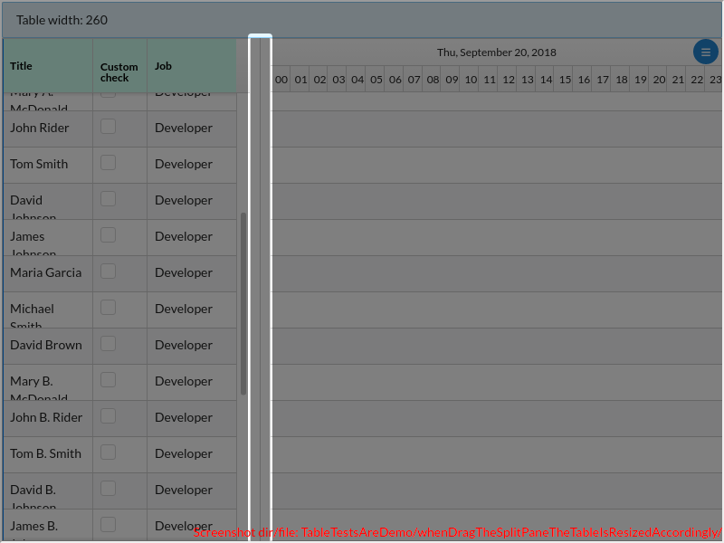
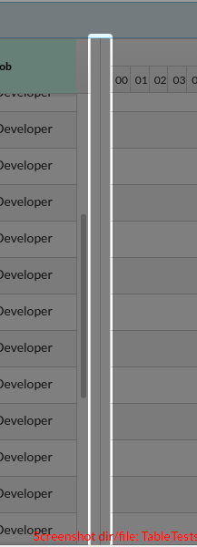

# TableTestsAreDemo/whenDragTheSplitPaneTheTableIsResizedAccordingly()

### undefined

---

## The following error was caught while running the test:

```
AssertionError: expected 725 to equal 425
	  at TableTestsAreDemo.whenDragTheSplitPaneTheTableIsResizedAccordingly [assert.equal((tad.getObjectViaCheat(Table) as Table).props.width, DEMO_TABLE_WIDTH + TABLE_OFFSET + 150);] (http://localhost:3000TableTestsAreDemo.tsx:64:16)
```

---


There are 1 screenshots. [Go to first](#screenshot-1)

## TableTestsAreDemo.tsx

<details><summary>Click to expand the hidden lines of code</summary>

```tsx
/* 1*/import { Scenario, render, tad } from "@famiprog-foundation/tests-are-demo";
/* 2*/import { assert } from "chai";
/* 3*/import { Table } from "fixed-data-table-2";
/* 4*/import { ProvidingCustomTable } from "../stories/table/Table.stories";
/* 5*/import { DEMO_TABLE_WIDTH, tableTestIds } from "../stories/table/TableScenarios";
/* 6*/import { TABLE_OFFSET, timelineTestids as testids } from "../../../src/timeline";
/* 7*/
/* 8*/export class TableTestsAreDemo {
/* 9*/    async before() {
/*10*/        render(<ProvidingCustomTable/>);
/*11*/        // When pressing run the second time the state of the scrollbars are not reset
/*12*/        // I thought that render() should reset its state, but it doesn't.
/*13*/        tad.screenCapturing.getByTestId(testids.ganttBody).scroll({top:0});
/*14*/        // TODO DB By running the tests second time, the SplitPane test fails because we need to reset its position
/*15*/        // Maybe a general mechanism of test sate reset is needed
/*16*/    }
/*17*/    
/*18*/    @Scenario("Both table and gantt diagram have same rows height")
/*19*/    async bothTableAndGanttHaveSameRowHeight() {
/*20*/        // Nu le putem verifica pe toate caci gridul este virtualizat
/*21*/        for (var i = 0; i < 5; i++)  {
/*22*/            let ganttRow = tad.screenCapturing.getByTestId(testids.row + "_" + i);
/*23*/            let tableCell = tad.screenCapturing.getByTestId(tableTestIds.row + "_" + i);
/*24*/            if (i < 4) { 
/*25*/                tad.cc("Table row "  + (i + 1) + " and  gantt row " + (i + 1) + " have same height");
/*26*/            } else {
/*27*/                tad.cc("And so on... ");
/*28*/            }
/*29*/            await tad.assertWaitable.equal(ganttRow.offsetHeight, (tableCell as HTMLElement).offsetHeight);
/*30*/        }
/*31*/    }
/*32*/
/*33*/    @Scenario("When scrolling in gantt the table is scrolled")
/*34*/    async whenScrollInGanttThenTableIsScrolled() {
/*35*/        // We don't focus on last element captured because its height occupies the entire page
/*36*/        // And the message appears under the gantt and is hidded by the scroll mechanism 
/*37*/        await tad.showSpotlight({ message: "Gantt is scrolled => Table is scrolled accordingly", focusOnLastElementCaptured: false });
/*38*/        tad.screenCapturing.getByTestId(testids.ganttBody).scroll({top:100});
/*39*/    
/*40*/        // This is needed in order for the scroll handler to be triggerd before the verification  
/*41*/        await new Promise(r => setTimeout(r, 10));
/*42*/
/*43*/        // We "cheated" here because
/*44*/        // There is no strait forward way to see the scroll position by looking at the html elements
/*45*/        // Because the table has a special type of scrolling mechanism by absolute positioning (with translate3d) 
/*46*/        // the rows. 
/*47*/        // We could have looked at the position of the first row but it was offseted with the
/*48*/        // height of the header in order to appear right under it. So we should have placed a data-testid on the header also
/*49*/        // but being in a third library component this was not simple to implement
/*50*/        assert.equal((tad.getObjectViaCheat(Table) as Table).props.scrollTop, 100);
/*51*/    }
/*52*/
/*53*/    @Scenario("When scrolling in table the gantt is scrolled")
```

</details>

```tsx
/*54*/    async whenScrollInTableThenGanttIsScrolled() {
/*55*/        await tad.showSpotlight({ message: "Table is scrolled => Gantt is scrolled accordingly", focusOnLastElementCaptured: false });
/*56*/        (tad.getObjectViaCheat(Table) as Table).scrollActions.scrollToY(300);
/*57*/        assert.equal(tad.screenCapturing.getByTestId(testids.ganttBody).scrollTop, 300);
/*58*/    }
/*59*/
/*60*/    @Scenario("When drag the split pane the table is resized accordingly")
/*61*/    async whenDragTheSplitPaneTheTableIsResizedAccordingly() {
/*62*/        tad.cc("Split pane resizer is dragged");
/*63*/        await tad.drag(tad.screenCapturing.getByTestId(testids.splitPaneResizer), { delta: { x: 150, y: 0 }});
```

<table><tr>
<td>

### Screenshot 1


<details><summary>Click to expand full image</summary>

TableTestsAreDemo/whenDragTheSplitPaneTheTableIsResizedAccordingly/Timeline_splitPaneResizer.png <br/>


</details>
</td>
<td>



</td>
</tr></table>

<details><summary>Click to expand the hidden lines of code</summary>

```tsx
/*64*/        assert.equal((tad.getObjectViaCheat(Table) as Table).props.width, DEMO_TABLE_WIDTH + TABLE_OFFSET + 150);
/*65*/    }
/*66*/}
```

</details>
