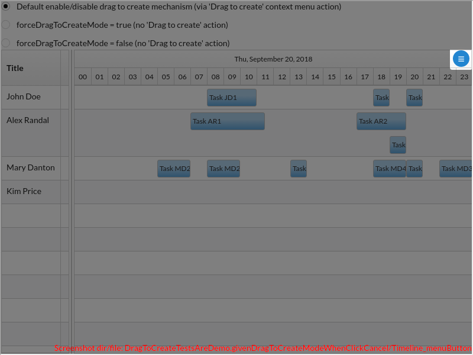
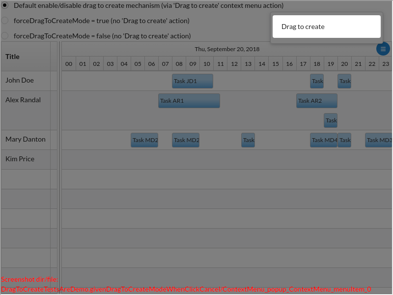
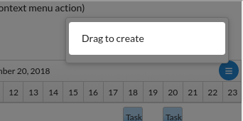
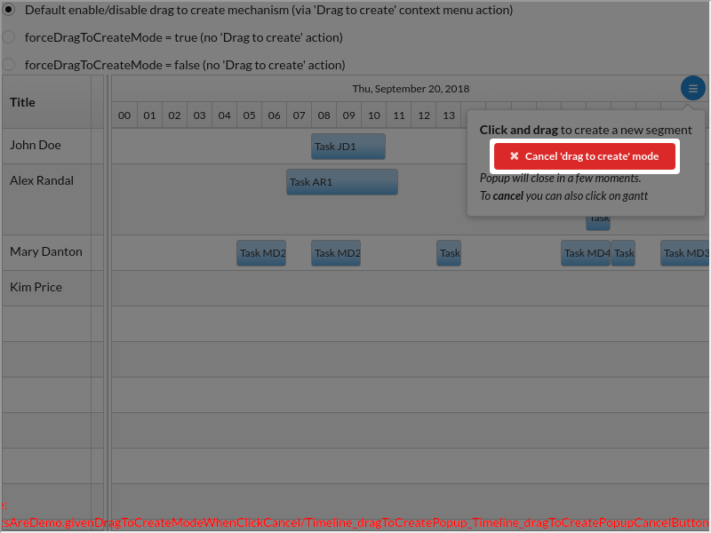
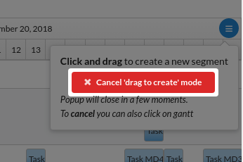
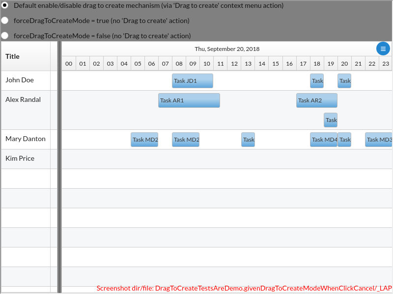

# DragToCreateTestsAreDemo.givenDragToCreateModeWhenClickCancel()

### GIVEN drag to create mode, WHEN click on cancel, THEN mode is cancelled

---

There are 4 screenshots. [Go to first](#screenshot-1)

## DragToCreateTestsAreDemo.tsx

<details><summary>Click to expand the hidden lines of code</summary>

```tsx
/*  1*/import { Only, render, Scenario, tad } from "@famiprog-foundation/tests-are-demo";
/*  2*/import { contextMenuTestIds } from "../../../src/components/ContextMenu/ContextMenu";
/*  3*/import { Main } from "../stories/dragToCreate/DragToCreate.stories";
/*  4*/import Timeline, { DRAG_TO_CREATE_ACTION_LABEL, DRAG_TO_CREATE_POPUP_CLOSE_TIME, DRAG_TO_CREATE_POPUP_LABEL_2, timelineTestids } from "../../../src/timeline";
/*  5*/import { dragToCreateStoriesTestIds as testIds } from "../stories/dragToCreate/DragToCreate.stories";
/*  6*/
/*  7*/export class DragToCreateTestsAreDemo {
/*  8*/
/*  9*/    async before() {
/* 10*/        render(<Main />);
/* 11*/    }
/* 12*/
/* 13*/    @Scenario("WHEN click on the menu button, THEN the menu opens with a 'Drag To Create' menu entry")
/* 14*/    async whenClickMenuButton() {
/* 15*/        tad.cc("Click on the menu button");
/* 16*/        await tad.userEventWaitable.click(tad.screenCapturing.getByTestId(timelineTestids.menuButton));
/* 17*/        tad.cc("Check if the context menu is open");
/* 18*/        await tad.assertWaitable.exists(tad.screenCapturing.getByTestId(contextMenuTestIds.popup));
/* 19*/
/* 20*/        tad.cc("Check if exist the 'Drag To Create' action");
/* 21*/        await tad.assertWaitable.equal(tad.screenCapturing.getByTestId(contextMenuTestIds.menuItem + "_0").textContent, DRAG_TO_CREATE_ACTION_LABEL);
/* 22*/        tad.getObjectViaCheat(Timeline).setState({ openedContextMenuCoordinates: undefined });
/* 23*/    }
/* 24*/
/* 25*/    @Scenario("WHEN click on the 'Drag To Create' menu entry, THEN the Gantt goes into the 'drag to create mode' and the drag to create popup appears")
/* 26*/    async whenClickAddMenuEntry() {
/* 27*/        // GIVEN context menu is opened by pressing the hamburger button
/* 28*/        await tad.userEventWaitable.click(tad.screenCapturing.getByTestId(timelineTestids.menuButton));
/* 29*/        
/* 30*/        // WHEN
/* 31*/        tad.cc("Click 'Drag To Create' menu entry");
/* 32*/        await tad.userEventWaitable.click(tad.screenCapturing.getByTestId(contextMenuTestIds.menuItem + "_0"));
/* 33*/
/* 34*/	    // THEN
/* 35*/        await tad.assertWaitable.isTrue(tad.getObjectViaCheat(Timeline).state.dragToCreateMode, "Drag to create mode should be active");
/* 36*/	
/* 37*/	    const popup = tad.screenCapturing.getByTestId(timelineTestids.dragToCreatePopup);
/* 38*/        tad.cc("Check if drag to create popup exists");
/* 39*/        await tad.assertWaitable.exists(popup);
/* 40*/        
/* 41*/        // Check the labels
/* 42*/        await tad.assertWaitable.equal(tad.withinCapturing(popup).getByTestId(timelineTestids.dragToCreatePopupLabel + "_1").innerHTML, "<b>Click and drag</b> to create a new segment");
/* 43*/        await tad.assertWaitable.equal(tad.withinCapturing(popup).getByTestId(timelineTestids.dragToCreatePopupLabel + "_2").textContent, DRAG_TO_CREATE_POPUP_LABEL_2);
/* 44*/        await tad.assertWaitable.equal(tad.withinCapturing(popup).getByTestId(timelineTestids.dragToCreatePopupLabel + "_3").innerHTML, "To <b>cancel</b> you can also click on gantt");
/* 45*/        const cancelButton = tad.withinCapturing(popup).getByTestId(timelineTestids.dragToCreatePopupCancelButton);
/* 46*/        tad.cc("Check if exists 'Cancel' button");
/* 47*/        await tad.assertWaitable.exists(cancelButton);
/* 48*/        tad.cc("Check if the cancel button is negative");
/* 49*/        await tad.assertWaitable.include(cancelButton.className, "negative");
/* 50*/
/* 51*/        // Test auto closing of the popup
/* 52*/        tad.demoForEndUserHide();
/* 53*/
/* 54*/        // AND the popup closes after DRAG_TO_CREATE_POPUP_CLOSE_TIME 
/* 55*/        // I tried to test also from time to time that the popup is opened but the setTimeout(time) 
/* 56*/        // doesn't ensure that exacly `time` has passed, it could have passed a little bit more (and that little bit cause
/* 57*/        // inexact test for when the popup is still opened)
/* 58*/        await new Promise(resolve => setTimeout(resolve, DRAG_TO_CREATE_POPUP_CLOSE_TIME));
/* 59*/        await tad.assertWaitable.notExists(tad.screenCapturing.queryByTestId(timelineTestids.dragToCreatePopup));
/* 60*/        
/* 61*/        // AND still in drag to create mode
/* 62*/        await tad.assertWaitable.isTrue(tad.getObjectViaCheat(Timeline).state.dragToCreateMode);
```

</details>

```tsx
/* 63*/        tad.demoForEndUserShow();
/* 64*/
/* 65*/        tad.getObjectViaCheat(Timeline).setState({ openedContextMenuCoordinates: undefined });
/* 66*/        tad.getObjectViaCheat(Timeline).setState({ dragToCreateMode: false });
/* 67*/    }
/* 68*/
/* 69*/    @Scenario("GIVEN drag to create mode, WHEN click on cancel, THEN mode is cancelled")
/* 70*/    async givenDragToCreateModeWhenClickCancel() {
/* 71*/        // GIVEN context menu was opened and 'Drag To Create' was pressed
/* 72*/        await tad.userEventWaitable.click(tad.screenCapturing.getByTestId(timelineTestids.menuButton));
```

<table><tr>
<td>

### Screenshot 1

 [Go to next](#screenshot-2)

<details><summary>Click to expand full image</summary>

DragToCreateTestsAreDemo.givenDragToCreateModeWhenClickCancel/Timeline_menuButton.png <br/>


</details>
</td>
<td>


</td>
</tr></table>

```tsx
/* 73*/        tad.cc("Click 'Drag To Create' menu entry");
/* 74*/        await tad.userEventWaitable.click(tad.screenCapturing.getByTestId(contextMenuTestIds.menuItem + "_0"));
```

<table><tr>
<td>

### Screenshot 2

[Go to previous](#screenshot-1) |  [Go to next](#screenshot-3)

<details><summary>Click to expand full image</summary>

DragToCreateTestsAreDemo.givenDragToCreateModeWhenClickCancel/ContextMenu_popup_ContextMenu_menuItem_0.png <br/>


</details>
</td>
<td>



</td>
</tr></table>

```tsx
/* 75*/
/* 76*/	    // WHEN
/* 77*/        tad.cc("Click on `Cancel 'drag to create' mode` button from the drag to create popup");
/* 78*/        await tad.userEventWaitable.click(tad.screenCapturing.getByTestId(timelineTestids.dragToCreatePopupCancelButton));
```

<table><tr>
<td>

### Screenshot 3

[Go to previous](#screenshot-2) |  [Go to next](#screenshot-4)

<details><summary>Click to expand full image</summary>

DragToCreateTestsAreDemo.givenDragToCreateModeWhenClickCancel/Timeline_dragToCreatePopup_Timeline_dragToCreatePopupCancelButton.png <br/>


</details>
</td>
<td>



</td>
</tr></table>

```tsx
/* 79*/        
/* 80*/        // THEN
/* 81*/        await tad.assertWaitable.isFalse(tad.getObjectViaCheat(Timeline).state.dragToCreateMode, "Check if the drag to create mode is cancelled");
```

<table><tr>
<td>

### Screenshot 4

[Go to previous](#screenshot-3)

<details><summary>Click to expand full image</summary>

DragToCreateTestsAreDemo.givenDragToCreateModeWhenClickCancel/_LAP.png <br/>


</details>
</td>
<td>


</td>
</tr></table>

<details><summary>Click to expand the hidden lines of code</summary>

```tsx
/* 82*/       
/* 83*/        tad.getObjectViaCheat(Timeline).setState({ openedContextMenuCoordinates: undefined });
/* 84*/        tad.getObjectViaCheat(Timeline).setState({ dragToCreateMode: false });
/* 85*/    }
/* 86*/
/* 87*/    @Scenario("GIVEN drag to create mode, WHEN click and drag, THEN a green selection rectangle appears")
/* 88*/    async givenDragToCreateModeWhenClickAndDrag() {
/* 89*/        tad.getObjectViaCheat(Timeline).setState({ dragToCreateMode: true });
/* 90*/
/* 91*/        await startDragKeepInProgress(3, 100);
/* 92*/        const selector = tad.screenCapturing.getByTestId(timelineTestids.selector);
/* 93*/        const { height } = selector.getBoundingClientRect();
/* 94*/        tad.cc("A green selection rectangle appears on the row");
/* 95*/        await tad.assertWaitable.exists(selector);
/* 96*/        let row = tad.screenCapturing.getByTestId(timelineTestids.row + "_4");
/* 97*/        await tad.showSpotlight({ message: "On drag to create mode in progress, when we move the mouse to the other row, selection rectangle stays only on the starting row, the mouse position is on the next row", focusOnLastElementCaptured: true });
/* 98*/        await tad.getObjectViaCheat(Timeline).dragMove(0, height);
/* 99*/        tad.cc("The height of the section regtagle isn't changed");
/*100*/        await tad.assertWaitable.equal(tad.screenCapturing.getByTestId(timelineTestids.selector).getBoundingClientRect().height, height);
/*101*/        row = tad.screenCapturing.getByTestId(timelineTestids.row + "_2");
/*102*/        await tad.showSpotlight({ message: "Move the mouse on previous row", focusOnLastElementCaptured: true });
/*103*/        await tad.getObjectViaCheat(Timeline).dragMove(0, -2 * height);
/*104*/        tad.cc("The height of the section regtagle isn't changed");
/*105*/        await tad.assertWaitable.equal(tad.screenCapturing.getByTestId(timelineTestids.selector).getBoundingClientRect().height, height);
/*106*/
/*107*/        tad.getObjectViaCheat(Timeline)._selectBox.end();
/*108*/        tad.getObjectViaCheat(Timeline).setState({ dragToCreateMode: false });
/*109*/    }
/*110*/
/*111*/    @Scenario("GIVEN drag to create in progress, WHEN right click, THEN cancel")
/*112*/    async givenDragToCreateModeInProgressWhenRightClick() {
/*113*/        tad.getObjectViaCheat(Timeline).setState({ dragToCreateMode: true });
/*114*/
/*115*/        let row = tad.screenCapturing.getByTestId(timelineTestids.row + "_3");
/*116*/        tad.cc("The row don't have the segments");
/*117*/        await tad.assertWaitable.equal(row.children.length, 0);
/*118*/        await startDragKeepInProgress(3, 100);
/*119*/        row = tad.screenCapturing.getByTestId(timelineTestids.row + "_3");
/*120*/        await tad.showSpotlight({ message: "We perform the right click", focusOnLastElementCaptured: true });
/*121*/        tad.getObjectViaCheat(Timeline).rightClick();
/*122*/        row = tad.screenCapturing.getByTestId(timelineTestids.row + "_3");
/*123*/        tad.cc("The segment wasn't created, the row don't have the segments");
/*124*/        await tad.assertWaitable.equal(row.children.length, 0);
/*125*/
/*126*/        tad.getObjectViaCheat(Timeline).setState({ dragToCreateMode: false });
/*127*/    }
/*128*/
/*129*/    @Scenario("GIVEN drag to create in progress, WHEN mouse up, THEN handler is called")
/*130*/    async givenDragToCreateModeInProgressWhenMouseUp() {
/*131*/        tad.getObjectViaCheat(Timeline).setState({ dragToCreateMode: true });
/*132*/
/*133*/        await startDragKeepInProgress(3, 100);
/*134*/        tad.screenCapturing.getByTestId(timelineTestids.row + "_3");
/*135*/        await tad.showSpotlight({ message: "We perform the mouse up", focusOnLastElementCaptured: true });
/*136*/        tad.getObjectViaCheat(Timeline).dragEnd();
/*137*/        tad.cc("The segment was created");
/*138*/        await tad.assertWaitable.exists(tad.screenCapturing.getByTestId(timelineTestids.item + "_11"));
/*139*/
/*140*/        tad.getObjectViaCheat(Timeline).setState({ dragToCreateMode: false });
/*141*/    }
/*142*/
/*143*/    @Scenario("WHEN forceDragToCreateMode = true/false, THEN action is not show and segments can/can't be created")
/*144*/    async whenForceDragToCreateModeTrueFalseThenActionIsNotShownAndSegmentsCanBeCreatedOrNot() {
/*145*/        // WHEN forceDragToCreate = true
/*146*/        await tad.cc("WHEN I set forceDragToCreate = true AND I drag to create");
/*147*/        await tad.userEventWaitable.click(tad.screenCapturing.getByTestId(testIds.forceDragToCreateModeTrueRadio));
/*148*/
/*149*/        // AND WHEN I drag and move
/*150*/        await startDragKeepInProgress(2, 100);
/*151*/        tad.screenCapturing.getByTestId(timelineTestids.row + "_2");
/*152*/
/*153*/        tad.cc("AND I perform");
/*154*/        const selector = tad.screenCapturing.getByTestId(timelineTestids.selector);
/*155*/        // THEN
/*156*/        tad.cc("THEN the drag to create rectangle appears on the row");
/*157*/        await tad.assertWaitable.exists(selector);
/*158*/        tad.cc("AND it is green");
/*159*/        await tad.assertWaitable.include(Array.from(selector.classList), "rct9k-selector-outer-add");
/*160*/
/*161*/        // AND WHEN I perform mouse up
/*162*/        await tad.showSpotlight({ message: "AND when I perform the mouse up", focusOnLastElementCaptured: true });
/*163*/        tad.getObjectViaCheat(Timeline).dragEnd();
/*164*/        
/*165*/        // THEN
/*166*/        tad.cc("THEN A segment is created");
/*167*/        await tad.assertWaitable.exists(tad.screenCapturing.getByTestId(timelineTestids.item + "_12"));
/*168*/
/*169*/        // AND 
/*170*/        await tad.userEventWaitable.click(tad.screenCapturing.getByTestId(timelineTestids.menuButton));
/*171*/        await tad.assertWaitable.notExists(tad.screenCapturing.queryByTestId(contextMenuTestIds.popup), "AND no 'Drag to create' action is shown");
/*172*/
/*173*/        // WHEN forceDragToCreate = false 
/*174*/        await tad.cc("WHEN I set forceDragToCreate = false AND I drag and drop");
/*175*/        // TODO era uitat await; dar crapa in modul "fast";
/*176*/        // insa de evitat interactiuni de UI inutile. A simula o actiune omeneasca (e.g. apasare pe buton)
/*177*/        // este un efort pentru noi. Ne e mult mai simplu sa apelam o functie care sa faca treaba, decat sa simulam
/*178*/        // actiunea. In cazul asta deci, cred ca era mai bine sa setam acel mod programatic
/*179*/        await tad.userEventWaitable.click(tad.screenCapturing.getByTestId(testIds.forceDragToCreateModeFalseRadio));
/*180*/
/*181*/        // THEN segments are not created at drag
/*182*/        await startDragKeepInProgress(2, 100);
/*183*/        tad.screenCapturing.getByTestId(timelineTestids.row + "_2");
/*184*/        tad.getObjectViaCheat(Timeline).dragEnd();
/*185*/        await tad.assertWaitable.notExists(tad.screenCapturing.queryByTestId(timelineTestids.item + "_13"));
/*186*/
/*187*/        // AND 
/*188*/        await tad.userEventWaitable.click(tad.screenCapturing.getByTestId(timelineTestids.menuButton));
/*189*/        await tad.assertWaitable.notExists(tad.screenCapturing.queryByTestId(contextMenuTestIds.popup), "AND no 'Drag to create' action is shown");
/*190*/    }
/*191*/}
/*192*/
/*193*/async function startDragKeepInProgress(rowNumber: number, x: number, xOffset: number = 10) {
/*194*/    // we need to get the row after each showSpotlight because on click next step the lastElementCaptured was lost
/*195*/    let row = tad.screenCapturing.getByTestId(timelineTestids.row + "_" + rowNumber);
/*196*/    await tad.showSpotlight({ message: "We perform click for start the drag", focusOnLastElementCaptured: true });
/*197*/    tad.getObjectViaCheat(Timeline).dragStart(row, xOffset);
/*198*/    row = tad.screenCapturing.getByTestId(timelineTestids.row + "_" + rowNumber);
/*199*/    await tad.showSpotlight({ message: "We perform mouse move with " + x + "px on X axis", focusOnLastElementCaptured: true });
/*200*/    await tad.getObjectViaCheat(Timeline).dragMove(x, 0);
/*201*/}
/*202*/
```

</details>
